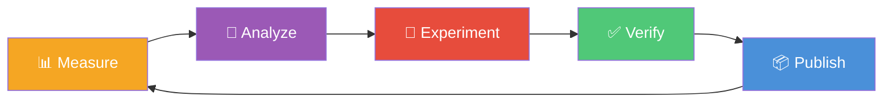

# Hone

**Agentic performance optimization for web APIs.**

Hone is a PowerShell-driven harness that automatically optimizes API performance through an iterative agentic loop. It measures with k6 load tests, analyzes bottlenecks with GitHub Copilot CLI, applies fixes, validates correctness, and repeats — producing a stack of reviewable PRs with measurable improvements.



## How It Works

- Hone runs an **iterative optimization loop**: Analyze → Experiment → Verify → Measure → Publish
- A **three-agent AI pipeline** drives each iteration:
  - **Analyst** — examines performance metrics and source code to identify the highest-impact optimization
  - **Classifier** — determines whether the proposed change is narrow (single-file) or architectural (multi-file)
  - **Fixer** — generates the optimized code for narrow-scope changes
- Each iteration runs **multi-run load tests** with k6 and computes median latency with variance analysis
- Results are compared against the previous baseline to compute **measured performance deltas**
- Passing iterations are published as **stacked PRs** — a linear branch chain, each reviewable independently
- Failed iterations (test failures or performance regressions) are **automatically reverted**
- An **optimization history** tracks what has been tried so agents don't repeat failed approaches
- The loop continues until performance targets are met or the configured iteration limit is reached

## Features

- 🔍 **Automatic performance regression detection** — flags iterations that make things worse
- 📊 **Multi-run median with variance analysis** — reduces noise from flaky measurements
- 🔗 **Stacked diffs mode** — linear branch chain with fire-and-forget PRs
- 🤖 **Three-agent AI pipeline** with scope classification (narrow vs. architectural)
- 📝 **Optimization history tracking** — avoids repeating failed approaches across iterations
- 🎯 **Multi-scenario stress testing** with per-scenario baselines and thresholds
- 📈 **.NET runtime counter collection** — CPU, GC, thread pool, working set metrics
- 📋 **HTML dashboard and terminal results display** for at-a-glance comparison

## Prerequisites

| Tool | Version | Install |
|------|---------|---------|
| PowerShell | 7.2+ | `winget install Microsoft.PowerShell` |
| .NET SDK | 6.0 | `winget install Microsoft.DotNet.SDK.6` |
| SQL Server LocalDB | 2019+ | Included with Visual Studio or `winget install Microsoft.SQLServer.2019.LocalDB` |
| k6 | Latest | `winget install GrafanaLabs.k6` |
| GitHub CLI | 2.0+ | `winget install GitHub.cli` |
| GitHub Copilot CLI | Latest | [Install standalone `copilot` CLI](https://docs.github.com/copilot/how-tos/copilot-cli) |

## Quick Start

```powershell
# 1. Clone the repo
git clone https://github.com/J-Bax/Hone.git
cd Hone
git submodule update --init --recursive

# 2. Build the sample API
dotnet build sample-api/SampleApi.sln

# 3. Run E2E tests (uses WebApplicationFactory, no running server needed)
dotnet test sample-api/SampleApi.Tests/

# 4. Establish a performance baseline
.\harness\Get-PerformanceBaseline.ps1

# 5. Run the full agentic optimization loop
.\harness\Invoke-HoneLoop.ps1
```

## Configuration

Edit `harness/config.psd1` to customize thresholds, iteration limits, API paths, and k6 scenarios. The config file is self-documented with inline comments for every setting.

See [docs/configuration.md](docs/configuration.md) for runtime override syntax.

## Documentation

- [Architecture](docs/architecture.md) — Design principles, loop flow, and decision logic
- [Getting Started](docs/getting-started.md) — Detailed setup guide
- [Configuration](docs/configuration.md) — Config overview and runtime overrides

---

<details>
<summary><strong>Logo Concepts</strong></summary>

<h3 align="center">Gemini</h3>

<table align="center">
  <tr>
    <td align="center">
      <br>
      <b>Option 1</b><br>Minimal Line Art
    </td>
    <td align="center">
      <br>
      <b>Option 2</b><br>Flat Geometric
    </td>
    <td align="center">
      <br>
      <b>Option 3</b><br>Kinetic Motion
    </td>
    <td align="center">
      <br>
      <b>Option 4</b><br>Abstract H
    </td>
    <td align="center">
      <br>
      <b>Option 5</b><br>Dark Mode Glow
    </td>
  </tr>
  <tr>
    <td align="center">
      <br>
      <b>Option 6</b><br>Tech Circuit
    </td>
    <td align="center">
      <br>
      <b>Option 7</b><br>Badge Style
    </td>
    <td align="center">
      <br>
      <b>Option 8</b><br>Typographic
    </td>
    <td align="center">
      <br>
      <b>Option 9</b><br>Isometric
    </td>
    <td align="center">
      <br>
      <b>Option 10</b><br>8-bit Retro
    </td>
  </tr>
</table>

<h3 align="center">Opus</h3>

<table align="center">
  <tr>
    <td align="center">
      <br>
      <b>Opus A</b><br>Polished Stone
    </td>
    <td align="center">
      <br>
      <b>Opus B</b><br>Spinning Speed
    </td>
    <td align="center">
      <br>
      <b>Opus C</b><br>Concentric Fire
    </td>
    <td align="center">
      <br>
      <b>Opus D</b><br>Industrial Grinder
    </td>
    <td align="center">
      <br>
      <b>Opus E</b><br>Sleek Arc
    </td>
  </tr>
  <tr>
    <td align="center">
      <br>
      <b>Opus F</b><br>Two-Tone Split
    </td>
    <td align="center">
      <br>
      <b>Opus G</b><br>Saw-Blade Edge
    </td>
    <td align="center">
      <br>
      <b>Opus H</b><br>Minimal Outline
    </td>
    <td align="center">
      <br>
      <b>Opus I</b><br>Chunky Warm
    </td>
    <td align="center">
      <br>
      <b>Opus J</b><br>Dark Contrast
    </td>
  </tr>
</table>

<h3 align="center">GPT</h3>

<table align="center">
  <tr>
    <td align="center">
      <br>
      <b>GPT A</b><br>Reference Polish
    </td>
    <td align="center">
      <br>
      <b>GPT B</b><br>Clean Badge
    </td>
    <td align="center">
      <br>
      <b>GPT C</b><br>Ember Halo
    </td>
    <td align="center">
      <br>
      <b>GPT D</b><br>Precision Outline
    </td>
    <td align="center">
      <br>
      <b>GPT E</b><br>Blade Sweep
    </td>
  </tr>
  <tr>
    <td align="center">
      <br>
      <b>GPT F</b><br>Faceted Stone
    </td>
    <td align="center">
      <br>
      <b>GPT G</b><br>Forge Seal
    </td>
    <td align="center">
      <br>
      <b>GPT H</b><br>Dark App Icon
    </td>
    <td align="center">
      <br>
      <b>GPT I</b><br>Iteration Orbit
    </td>
    <td align="center">
      <br>
      <b>GPT J</b><br>H Monogram
    </td>
  </tr>
</table>

<h3 align="center">Isometric Trades</h3>

<table align="center">
  <tr>
    <td align="center">
      <br>
      <b>ISO A</b><br>Horizontal Chisel
    </td>
    <td align="center">
      <br>
      <b>ISO B</b><br>Vertical Chisel Wheel
    </td>
    <td align="center">
      <br>
      <b>ISO C</b><br>Plane Iron
    </td>
    <td align="center">
      <br>
      <b>ISO D</b><br>Axe Head
    </td>
    <td align="center">
      <br>
      <b>ISO E</b><br>Drill Bit
    </td>
  </tr>
  <tr>
    <td align="center">
      <br>
      <b>ISO F</b><br>Masonry Chisel
    </td>
    <td align="center">
      <br>
      <b>ISO G</b><br>Bench Wheel
    </td>
    <td align="center">
      <br>
      <b>ISO H</b><br>Screwdriver Tip
    </td>
    <td align="center">
      <br>
      <b>ISO I</b><br>Cabinet Scraper
    </td>
    <td align="center">
      <br>
      <b>ISO J</b><br>Hoe Edge
    </td>
  </tr>
</table>

<h3 align="center">Isometric Trades v2</h3>

<table align="center">
  <tr>
    <td align="center">
      <br>
      <b>ISO2 A</b><br>Bench Chisel
    </td>
    <td align="center">
      <br>
      <b>ISO2 B</b><br>Mortise Chisel
    </td>
    <td align="center">
      <br>
      <b>ISO2 C</b><br>Plane Iron
    </td>
    <td align="center">
      <br>
      <b>ISO2 D</b><br>Broad Axe
    </td>
    <td align="center">
      <br>
      <b>ISO2 E</b><br>Twist Drill
    </td>
  </tr>
  <tr>
    <td align="center">
      <br>
      <b>ISO2 F</b><br>Cold Chisel
    </td>
    <td align="center">
      <br>
      <b>ISO2 G</b><br>Screwdriver
    </td>
    <td align="center">
      <br>
      <b>ISO2 H</b><br>Adze
    </td>
    <td align="center">
      <br>
      <b>ISO2 I</b><br>Spade Bit
    </td>
    <td align="center">
      <br>
      <b>ISO2 J</b><br>Shovel Edge
    </td>
  </tr>
</table>

<h3 align="center">Graphic Grinder Style</h3>

<table align="center">
  <tr>
    <td align="center">
      <br>
      <b>Graphic A</b><br>Chisel Grinder
    </td>
    <td align="center">
      <br>
      <b>Graphic B</b><br>Plane Iron
    </td>
    <td align="center">
      <br>
      <b>Graphic C</b><br>Axe Wheel
    </td>
    <td align="center">
      <br>
      <b>Graphic D</b><br>Screwdriver
    </td>
  </tr>
  <tr>
    <td align="center">
      <br>
      <b>Graphic E</b><br>Drill Grinder
    </td>
    <td align="center">
      <br>
      <b>Graphic F</b><br>Cold Chisel
    </td>
    <td align="center">
      <br>
      <b>Graphic G</b><br>Shovel Edge
    </td>
    <td align="center">
      <br>
      <b>Graphic H</b><br>Adze Wheel
    </td>
  </tr>
</table>

</details>
