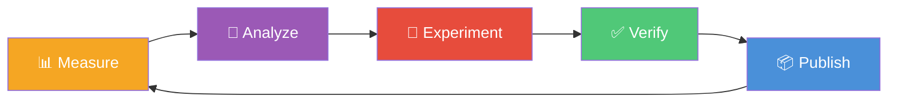

# Hone

<p align="center">
  
</p>

**Agentic performance optimization for web APIs.**

Hone is an experimental harness that automatically optimizes API performance through an iterative agentic loop. It measures with k6 load tests, analyzes bottlenecks with GitHub Copilot CLI, applies fixes, validates correctness, and repeats — producing a stack of reviewable PRs with measurable improvements.



## How It Works

- A **five-agent AI pipeline** drives each experiment:
  - **CPU Profiler** — analyzes PerfView CPU sampling stacks to pinpoint hot methods and call paths
  - **Memory Profiler** — analyzes PerfView GC statistics and allocation data to identify memory pressure sources
  - **Top-level Analyst** — examines upleveled profiling data, and source code to identify the highest-impact optimization
  - **Classifier** — determines whether the proposed change is narrow or architectural (deferred — requiring expert sign-off)
  - **Fixer** — generates the optimized code for narrow-scope changes
- Each experiment runs **multi-run load tests**: tracking latency, throughput and efficiency metrics (CPU, Memory)
- Results are compared against the previous baseline to compute **performance deltas**
- Fixes must pass two gates: **E2E functional tests**, and **improve load test metrics**
- Passing experiments are published as **stacked PRs** — a linear branch chain, each reviewable independently
- Failed experiments (test failures or performance regressions) are **automatically reverted**
- An **optimization history** tracks what has been tried so agents don't repeat failed approaches
- The loop continues until the configured experiment limit is reached or improvements plateau

## Sample API Results

On the included sample API (.NET 6 ecommerce service), Hone autonomously completed **35 experiments in ~24 hours** — accepting 29 and rejecting 6 — while E2E tests continued to pass throughout:

| Metric | Baseline | After Optimization | Improvement |
|--------|----------|-------------------|-------------|
| P50 Latency | 305.7 ms | 132.2 ms | 56.8% |
| P95 Latency | 7546.1 ms | 544.4 ms | **92.8%** |
| Throughput (RPS) | 125.5 | 1129.2 | **800%** |
| CPU Avg Utilization | 46.2% | 13.2% | 71.4% |
| % Time in GC | 38% | 2.2% | **94.2%** |
| GC Heap Max | 3424 MB | 844 MB | 75.5% |

Fixes spanned multiple categories: database indexes, SELECT projection, N+1 query elimination (one API generated 150+ DB round trips per request), request batching, and EF ReadOnly mode for queries.

All diffs include a detailed root-cause analysis and explanation of fix — see the [full set of stacked PRs](https://github.com/J-Bax/Hone-SampleAPI/pulls) and [experiment-1](https://github.com/J-Bax/Hone-SampleAPI/pull/67) as an example.

## Features

- 🔍 **Automatic performance regression detection** — flags experiments that make things worse
- 📊 **Multi-run median with variance analysis** — reduces noise from flaky measurements
- 🔗 **Stacked diffs mode** — linear branch chain with fire-and-forget PRs
- 🤖 **Five-agent AI pipeline** with scope classification (narrow vs. architectural)
- 🔬 **Deep diagnostic profiling** — PerfView CPU stacks, GC analysis, and allocation tracking via plugin framework
- 📝 **Optimization history tracking** — avoids repeating failed approaches across experiments
- 🎯 **Multi-scenario stress testing** with per-scenario baselines and thresholds
- 📈 **.NET runtime counter collection** — CPU, GC, thread pool, working set metrics
- 🔌 **Plugin architecture** — add new profiling tools by dropping in a directory
- 📋 **HTML dashboard and terminal results display** for at-a-glance comparison

> [!WARNING]
> Hone is **not architected for production use cases**. It is an experimental project intended for research and learning purposes only. Use at your own risk.

## Prerequisites

| Tool | Version | Install |
|------|---------|---------|
| PowerShell | 7.2+ | `winget install Microsoft.PowerShell` |
| .NET SDK | 6.0 | `winget install Microsoft.DotNet.SDK.6` |
| SQL Server LocalDB | 2019+ | Included with Visual Studio or `winget install Microsoft.SQLServer.2019.LocalDB` |
| k6 | Latest | `winget install GrafanaLabs.k6` |
| GitHub CLI | 2.0+ | `winget install GitHub.cli` |
| GitHub Copilot CLI | Latest | [Install standalone `copilot` CLI](https://docs.github.com/copilot/how-tos/copilot-cli) — separate from `gh` |
| PerfView | Latest | Auto-downloaded by `Setup-DevEnvironment.ps1` |

> **Note:** PerfView requires **Administrator privileges** for kernel-level CPU sampling. Run the harness in an elevated terminal when diagnostic profiling is enabled.

## Quick Start

```powershell
# 1. Clone the repo
git clone https://github.com/J-Bax/Hone.git
cd Hone
git submodule update --init --recursive

# 2. Build the sample API
dotnet build sample-api/SampleApi.sln

# 3. Run E2E tests (uses WebApplicationFactory, no running server needed)
dotnet test sample-api/SampleApi.Tests/

# 4. Establish a performance baseline
.\harness\Get-PerformanceBaseline.ps1

# 5. Run the full agentic optimization loop
.\harness\Invoke-HoneLoop.ps1
```

## Configuration

Edit `harness/config.psd1` to customize thresholds, experiment limits, API paths, and k6 scenarios. The config file is self-documented with inline comments for every setting.

See [docs/configuration.md](docs/configuration.md) for runtime override syntax.

## Documentation

- [Architecture](docs/architecture.md) — Design principles, loop flow, and decision logic
- [Agent Designs](docs/agent-designs.md) — Five-agent AI pipeline: roles, inputs, outputs, and model configuration
- [Getting Started](docs/getting-started.md) — Detailed setup guide
- [Configuration](docs/configuration.md) — Config overview and runtime overrides
- [Future Extensions](docs/future-extensions.md) — Design ideas: actor-critic fixer, correction of error, optimization knowledge base

## License

This project is licensed under the [MIT License](LICENSE).

