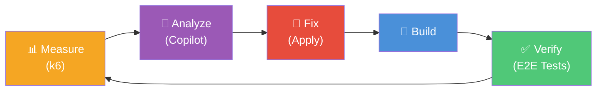

# Hone

**Agentic performance optimization for web APIs.**

Hone is a PowerShell-driven harness that automatically optimizes API performance through an iterative agentic loop. It measures with k6 load tests, analyzes bottlenecks with GitHub Copilot CLI, applies fixes, validates correctness, and repeats — producing a stack of reviewable PRs with measurable improvements.



## Prerequisites

| Tool | Version | Install |
|------|---------|---------|
| PowerShell | 7.2+ | `winget install Microsoft.PowerShell` |
| .NET SDK | 6.0 | `winget install Microsoft.DotNet.SDK.6` |
| SQL Server LocalDB | 2019+ | Included with Visual Studio or `winget install Microsoft.SQLServer.2019.LocalDB` |
| k6 | Latest | `winget install GrafanaLabs.k6` |
| GitHub CLI | 2.0+ | `winget install GitHub.cli` |
| GitHub Copilot CLI | Latest | [Install standalone `copilot` CLI](https://docs.github.com/copilot/how-tos/copilot-cli) |

## Quick Start

```powershell
# 1. Clone the repo
git clone https://github.com/J-Bax/Hone.git
cd Hone
git submodule update --init --recursive

# 2. Build the sample API
dotnet build sample-api/SampleApi.sln

# 3. Run E2E tests (uses WebApplicationFactory, no running server needed)
dotnet test sample-api/SampleApi.Tests/

# 4. Establish a performance baseline
.\harness\Get-PerformanceBaseline.ps1

# 5. Run the full agentic optimization loop
.\harness\Invoke-HoneLoop.ps1
```

## Configuration

Edit `harness/config.psd1` to customize thresholds, iteration limits, API paths, and k6 scenarios. The config file is self-documented with inline comments for every setting.

See [docs/configuration.md](docs/configuration.md) for runtime override syntax.

## Documentation

- [Architecture](docs/architecture.md) — Design principles, loop flow, and decision logic
- [Getting Started](docs/getting-started.md) — Detailed setup guide
- [Configuration](docs/configuration.md) — Config overview and runtime overrides
