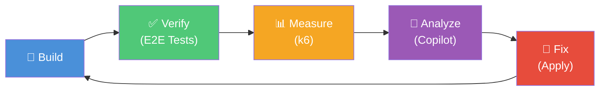
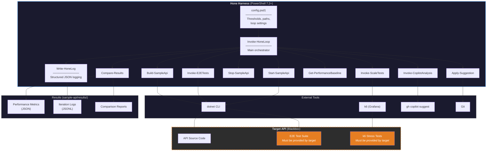
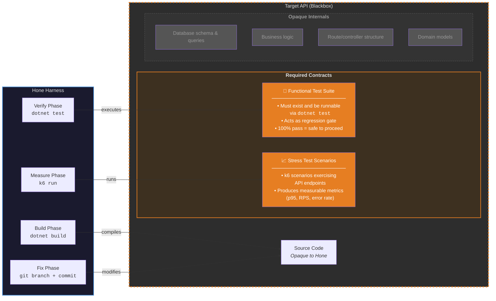
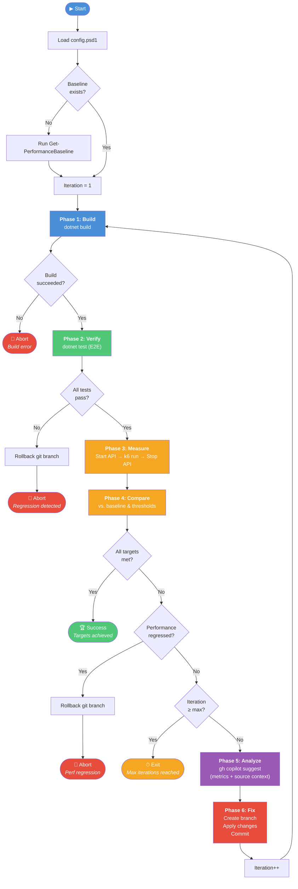
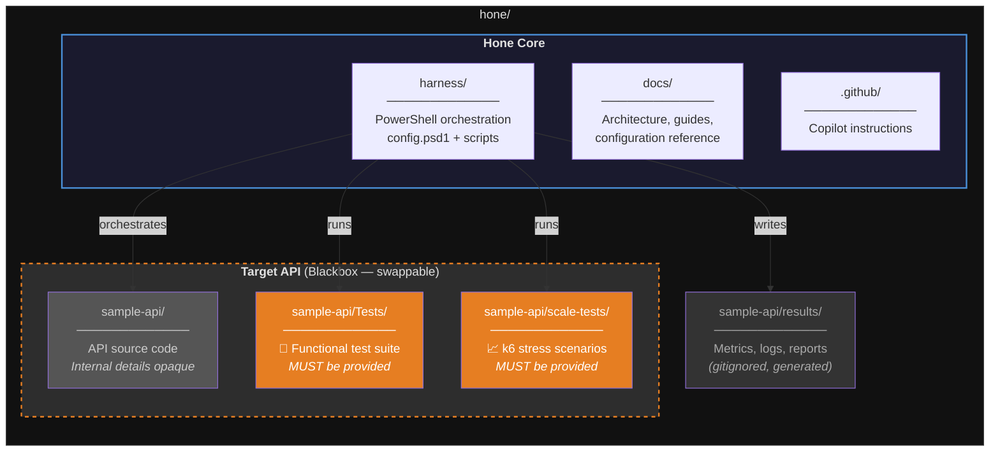

# Hone

**Agentic performance optimization for web APIs.**

Hone is a PowerShell-driven harness that automatically optimizes the performance of API services through an iterative agentic loop. It builds your project, verifies correctness with E2E tests, measures performance with k6 load tests, uses GitHub Copilot CLI to brainstorm optimizations, applies fixes, and repeats — until performance targets are met or iteration limits are reached.



## Architecture Diagrams

### Component Architecture

The Hone harness is a set of PowerShell scripts that orchestrate external tools. The **Target API is a blackbox** — Hone only interacts with it through well-defined boundaries: build commands, test runners, and HTTP endpoints.



### Target API Contract (Blackbox Boundary)

Hone treats the target API as an opaque system. It does **not** understand the API's internal implementation. However, the target **must** provide two key artifacts that Hone depends on:



### Agentic Loop Flowchart

The complete decision flow for a single invocation of `Invoke-HoneLoop.ps1`:



### Data Flow

How data moves through the system across a single iteration:

```mermaid
flowchart LR
    subgraph INPUTS["Inputs"]
        CFG["config.psd1<br/>(thresholds, paths)"]
        BASELINE["baseline.json<br/>(reference metrics)"]
        PREV["Previous iteration<br/>metrics"]
    end

    subgraph PHASE_BUILD["Build"]
        DOTNET_BUILD["dotnet build"] --> BUILD_OUT["Build output<br/>(pass/fail)"]
    end

    subgraph PHASE_VERIFY["Verify"]
        DOTNET_TEST["dotnet test"] --> TRX["Test results<br/>(pass/fail count)"]
    end

    subgraph PHASE_MEASURE["Measure"]
        K6_RUN["k6 run"] --> K6_JSON["JSON summary<br/>• p95 latency<br/>• RPS<br/>• Error rate"]
    end

    subgraph PHASE_COMPARE["Compare"]
        DELTA["Compute deltas<br/>vs. baseline &<br/>previous iteration"]
    end

    subgraph PHASE_ANALYZE["Analyze"]
        PROMPT["Build prompt:<br/>metrics + deltas +<br/>source context"]
        PROMPT --> COPILOT["gh copilot suggest"]
        COPILOT --> SUGGESTION["Suggested<br/>code changes"]
    end

    subgraph PHASE_FIX["Fix"]
        BRANCH["git branch<br/>hone/iteration-N"]
        COMMIT["Apply changes<br/>+ commit"]
    end

    subgraph OUTPUTS["Outputs"]
        LOG_FILE["hone-*.jsonl<br/>(audit trail)"]
        RESULT_JSON["iteration-N.json<br/>(metrics snapshot)"]
        GIT_BRANCH["Git branch<br/>(rollback point)"]
    end

    CFG --> DOTNET_BUILD
    CFG --> DOTNET_TEST
    CFG --> K6_RUN
    BUILD_OUT --> DOTNET_TEST
    TRX --> K6_RUN
    K6_JSON --> DELTA
    BASELINE --> DELTA
    PREV --> DELTA
    DELTA --> PROMPT
    SUGGESTION --> BRANCH
    BRANCH --> COMMIT

    DELTA --> LOG_FILE
    K6_JSON --> RESULT_JSON
    COMMIT --> GIT_BRANCH

    style INPUTS fill:#1a1a2e,color:#e0e0e0,stroke:#4a90d9
    style OUTPUTS fill:#1a1a2e,color:#e0e0e0,stroke:#50c878
    style PHASE_BUILD fill:#1e2a3a,color:#e0e0e0,stroke:#4a90d9
    style PHASE_VERIFY fill:#1e2a3a,color:#e0e0e0,stroke:#50c878
    style PHASE_MEASURE fill:#1e2a3a,color:#e0e0e0,stroke:#f5a623
    style PHASE_COMPARE fill:#1e2a3a,color:#e0e0e0,stroke:#f5a623
    style PHASE_ANALYZE fill:#1e2a3a,color:#e0e0e0,stroke:#9b59b6
    style PHASE_FIX fill:#1e2a3a,color:#e0e0e0,stroke:#e74c3c
```



## How It Works

1. **Build** — Compiles the target API project (`dotnet build`)
2. **Verify** — Runs functional E2E tests to ensure correctness (`dotnet test`)
3. **Measure** — Executes k6 load tests to capture performance metrics (p95 latency, RPS, error rate)
4. **Analyze** — Sends performance data and hot-path context to GitHub Copilot CLI (`gh copilot suggest`) to brainstorm optimizations
5. **Fix** — Applies Copilot's suggested changes on a new git branch
6. **Repeat** — Loops back to Build, validating the fix doesn't regress functionality or performance

The loop exits when performance targets are met, the maximum iteration count is reached, or a regression is detected.

## Prerequisites

| Tool | Version | Install |
|------|---------|---------|
| PowerShell | 7.2+ | `winget install Microsoft.PowerShell` |
| .NET SDK | 6.0 | `winget install Microsoft.DotNet.SDK.6` |
| SQL Server LocalDB | 2019+ | Included with Visual Studio or `winget install Microsoft.SQLServer.2019.LocalDB` |
| k6 | Latest | `winget install Grafana.k6` |
| GitHub CLI | 2.0+ | `winget install GitHub.cli` |
| GitHub Copilot CLI | Latest | `gh extension install github/gh-copilot` |

## Quick Start

```powershell
# 1. Clone the repo
git clone https://github.com/your-org/hone.git
cd hone

# 2. Build the sample API
dotnet build sample-api/SampleApi.sln

# 3. Run E2E tests (uses WebApplicationFactory, no running server needed)
dotnet test sample-api/SampleApi.Tests/

# 4. Establish a performance baseline
.\harness\Get-PerformanceBaseline.ps1

# 5. Run the full agentic optimization loop
.\harness\Invoke-HoneLoop.ps1
```

## Project Structure



> **Key insight**: The target API is a **blackbox** to Hone. The harness only requires that the target provides: **(1)** a buildable source project, **(2)** a functional test suite (regression gate), and **(3)** k6 stress test scenarios (performance measurement). Everything else — database schema, business logic, route structure, domain models — is opaque.

```
hone/
├── .github/                    # GitHub configuration & Copilot instructions
│   ├── copilot-instructions.md
│   └── ISSUE_TEMPLATE/
├── docs/                       # Architecture, guides, and reference docs
│   ├── architecture.md
│   ├── getting-started.md
│   ├── agentic-loop.md
│   └── configuration.md
├── sample-api/                 # Target API (blackbox — swappable)
│   ├── SampleApi/              # API source code (opaque internals)
│   ├── SampleApi.Tests/        # ⚠ Functional test suite (REQUIRED)
│   ├── scale-tests/            # ⚠ k6 load test scenarios (REQUIRED)
│   │   ├── scenarios/
│   │   └── thresholds.json
│   └── results/                # Output: metrics, reports, logs (gitignored)
├── harness/                    # PowerShell orchestration scripts
│   ├── config.psd1             # Harness configuration
│   ├── Invoke-HoneLoop.ps1     # Main entry point
│   └── ...                     # Build, test, measure, analyze, fix scripts
```

## Configuration

Edit `harness/config.psd1` to customize:
- Performance thresholds (p95 latency, RPS targets)
- Maximum optimization iterations
- API URL and project paths
- k6 scenario selection

See [docs/configuration.md](docs/configuration.md) for the full reference.

## Documentation

- [Architecture](docs/architecture.md) — System design and component interactions
- [Getting Started](docs/getting-started.md) — Detailed setup guide
- [Agentic Loop](docs/agentic-loop.md) — Deep dive into each optimization phase
- [Configuration](docs/configuration.md) — All settings explained
