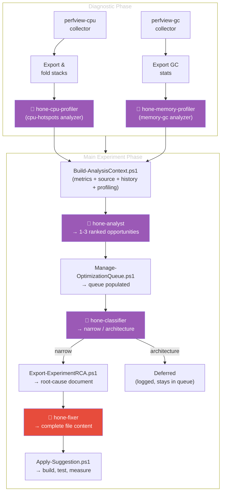

# Agent Designs

Hone uses a **five-agent AI pipeline** to drive each optimization experiment. This document covers each agent's role, inputs, outputs, prompt construction, model configuration, and how they chain together.

For the overall system architecture and loop flow, see [architecture.md](architecture.md).

## Agent Pipeline Overview

The agents operate in two phases: **diagnostic analysis** (when the optimization queue is empty) and **main experiment** (for each queued optimization).



The diagnostic phase runs PerfView profiling and feeds the results through specialized analyzer agents. Their reports are injected into the main analyst's prompt alongside performance metrics and source code. The analyst produces ranked optimization opportunities that populate a queue. Each queued item goes through classification (narrow vs. architecture) — narrow items proceed to the fixer agent for code generation.

## Agents

### hone-cpu-profiler

| | |
|---|---|
| **Definition** | `harness/analyzers/cpu-hotspots/agent.md` (symlinked to `.github/agents/hone-cpu-profiler.agent.md`) |
| **Invoker** | `harness/analyzers/cpu-hotspots/Invoke-Analyzer.ps1` |
| **Metadata** | `harness/analyzers/cpu-hotspots/analyzer.psd1` |
| **Default model** | `claude-opus-4.6` (via `Diagnostics.AnalyzerSettings.'cpu-hotspots'.Model`) |
| **Tools** | None — receives all data in the prompt |
| **Required collectors** | `perfview-cpu` |

**Purpose.** Analyzes folded CPU sampling stacks from PerfView to identify performance-critical methods and call paths. Focuses on application code over framework internals.

**Inputs.** Top N folded stacks by sample count (configurable via `MaxStacks`, default 100) and current performance metrics (p95 latency, RPS, error rate).

**Output schema:**

```json
{
  "hotspots": [
    {
      "method": "Full.Namespace.Class.Method",
      "inclusivePct": 34.5,
      "exclusivePct": 12.3,
      "callChain": ["Caller1", "Caller2", "...TargetMethod"],
      "observation": "Why this is a hotspot and what causes the CPU usage"
    }
  ],
  "summary": "2-3 sentence summary of the CPU profile"
}
```

**Output flow.** The report is stored in `DiagnosticReports['cpu-hotspots']` and injected into the hone-analyst's prompt under the "Diagnostic Profiling Reports" section. The prompt is saved to `experiment-N/diagnostics/cpu-hotspots/cpu-hotspots-prompt.md`.

---

### hone-memory-profiler

| | |
|---|---|
| **Definition** | `harness/analyzers/memory-gc/agent.md` (symlinked to `.github/agents/hone-memory-profiler.agent.md`) |
| **Invoker** | `harness/analyzers/memory-gc/Invoke-Analyzer.ps1` |
| **Metadata** | `harness/analyzers/memory-gc/analyzer.psd1` |
| **Default model** | `claude-opus-4.6` (via `Diagnostics.AnalyzerSettings.'memory-gc'.Model`) |
| **Tools** | None — receives all data in the prompt |
| **Required collectors** | `perfview-gc` |
| **Optional collectors** | `perfview-cpu` (for allocation type data) |

**Purpose.** Analyzes PerfView GC statistics, heap behavior, and allocation patterns to identify memory pressure sources and GC overhead.

**Inputs.** GC report from the `perfview-gc` collector, optional allocation type data from the `perfview-cpu` collector (which captures allocation ticks via `/DotNetAllocSampled`), and current performance metrics.

**Output schema:**

```json
{
  "gcAnalysis": {
    "gen0Rate": 45.2,
    "gen1Rate": 5.1,
    "gen2Rate": 1.3,
    "pauseTimeMs": { "avg": 2.1, "max": 15.3, "total": 420.5 },
    "gcPauseRatio": 3.2,
    "fragmentationPct": 12.5,
    "observations": ["..."]
  },
  "heapAnalysis": {
    "peakSizeMB": 256.3,
    "avgSizeMB": 180.5,
    "lohSizeMB": 12.3,
    "observations": ["..."]
  },
  "topAllocators": [
    {
      "type": "System.String",
      "allocMB": 450.2,
      "pctOfTotal": 35.2,
      "callSite": "ProductsController.Search → String.Concat",
      "observation": "String concatenation in hot path — consider StringBuilder"
    }
  ],
  "summary": "2-3 sentence summary of memory behavior"
}
```

**Output flow.** The report is stored in `DiagnosticReports['memory-gc']` and injected into the hone-analyst's prompt. The prompt is saved to `experiment-N/diagnostics/memory-gc/memory-gc-prompt.md`.

---

### hone-analyst

| | |
|---|---|
| **Definition** | `.github/agents/hone-analyst.agent.md` |
| **Invoker** | `harness/Invoke-AnalysisAgent.ps1` → `Invoke-CopilotAgent.ps1` |
| **Prompt builder** | `harness/Build-AnalysisContext.ps1` |
| **Default model** | `claude-opus-4.6` (via `Copilot.AnalysisModel`) |
| **Tools** | `read` — can read source files directly |

**Purpose.** The orchestrating analysis agent. Examines performance metrics, profiling data, source code, and optimization history to identify the highest-impact optimization opportunities. This is the most context-heavy agent in the pipeline.

**Prompt construction.** `Build-AnalysisContext.ps1` assembles five context sections:

| Section | Content | Source |
|---------|---------|--------|
| **SourceFilePaths** | List of API source files (paths only — agent reads files itself) | Filesystem scan of `Api.ProjectPath` |
| **CounterContext** | .NET runtime counters: CPU avg, GC heap max, Gen2 collections, thread pool | `dotnet-counters` collector |
| **TrafficContext** | k6 scenario source code showing request weights and endpoint distribution | k6 scenario file |
| **HistoryContext** | Previously tried optimizations, optimization queue state, last experiment's fix, experiment metrics table | `experiment-log.md`, `experiment-queue.json`, `run-metadata.json` |
| **ProfilingContext** | Diagnostic reports from analyzer agents (CPU hotspots, memory/GC analysis) | `DiagnosticReports` hashtable |

The invoker (`Invoke-AnalysisAgent.ps1`) wraps these sections into a structured prompt alongside current and baseline performance metrics, then delegates to the unified agent runner (`Invoke-CopilotAgent.ps1`) which handles model resolution, UTF-8 encoding, timeout enforcement (configurable via `Copilot.AgentTimeoutSec`, default 600s), JSON extraction, and retry logic.

**Inputs.** Current metrics (p95, RPS, error rate), baseline metrics, comparison result, .NET counter metrics, optimization history, diagnostic profiling reports, and previous experiment's RCA explanation.

**Output schema:**

```json
{
  "opportunities": [
    {
      "filePath": "SampleApi/Controllers/ExampleController.cs",
      "title": "Short descriptive title",
      "scope": "narrow",
      "rootCause": "## Evidence\n...\n## Theory\n...\n## Proposed Fixes\n...\n## Expected Impact\n...",
      "impactEstimate": {
        "trafficPct": 35,
        "latencyReductionMs": 40,
        "overallP95ImprovementPct": 8.5,
        "confidence": "medium",
        "reasoning": "Derivation of the estimate"
      }
    }
  ]
}
```

The `rootCause` field is a markdown document with four required sections: Evidence (code snippets + line numbers), Theory (why the pattern causes poor performance), Proposed Fixes (what to change and where), and Expected Impact (which metrics should improve).

**Output handling.** Parsed opportunities are fed into the optimization queue via `Manage-OptimizationQueue.ps1`. The primary opportunity's `filePath` and `rootCause` are passed downstream to the classifier and fixer.

**Artifacts saved:**
- `experiment-N/analysis-prompt.md` — the full prompt sent to the agent
- `experiment-N/analysis-response.json` — the raw response

**Key rules enforced by the agent definition:**
- 1–3 opportunities per analysis, ranked by expected impact
- Must respect optimization history — never re-suggest tried approaches
- No full file embeds in root cause — cite by file:line with short snippets
- No code generation — only describes what to change and where
- Must classify each opportunity as `narrow` or `architecture`

---

### hone-classifier

| | |
|---|---|
| **Definition** | `.github/agents/hone-classifier.agent.md` |
| **Invoker** | `harness/Invoke-ClassificationAgent.ps1` → `Invoke-CopilotAgent.ps1` |
| **Default model** | `claude-haiku-4.5` (via `Copilot.ClassificationModel`) |
| **Tools** | `read` — reads the target file to verify scope |

**Purpose.** Binary scope classification gate. Determines whether a proposed optimization is **narrow** (single-file, implementation-only) or **architecture** (multi-file, schema change, new dependency). Only narrow-classified changes proceed to the fixer agent.

**Inputs.** Target file path (relative to `sample-api/`) and the optimization explanation from the analyst.

**Output schema:**

```json
{
  "scope": "narrow",
  "reasoning": "One-sentence explanation of why this classification was chosen."
}
```

**Classification criteria:**
- **Narrow**: modifies one file, changes only implementation internals, no new dependencies, no migrations, no API contract changes
- **Architecture**: multi-file changes, new packages, schema migrations, endpoint changes, new architectural patterns

**Retry logic.** The classifier has built-in retry handling (up to 3 attempts):
1. On JSON parse failure, the prompt is augmented with a strict RFC 8259 JSON reminder
2. JavaScript-style literals (`NaN`, `Infinity`) are sanitized to `null` before parsing
3. On complete failure after all retries, defaults to `architecture` (safe fallback — requires manual review rather than risking an incorrect narrow classification)

**Artifacts saved:**
- `experiment-N/classification-response.json`

---

### hone-fixer

| | |
|---|---|
| **Definition** | `.github/agents/hone-fixer.agent.md` |
| **Invoker** | `harness/Invoke-FixAgent.ps1` → `Invoke-CopilotAgent.ps1` |
| **Default model** | `claude-sonnet-4.6` (via `Copilot.FixModel`) |
| **Tools** | `read` — reads the target file before generating the replacement |

**Purpose.** Generates the complete optimized file content for narrow-scope changes. This is the only agent that produces code — all other agents produce analysis and classifications.

**Inputs.** Target file path, optimization explanation, and an optional root-cause document. The root-cause document (generated by `Export-ExperimentRCA.ps1`) provides the fixer with detailed evidence, theory, and proposed approaches from the analyst's root-cause analysis.

**Prompt structure:**

```
Apply this specific optimization to the file and return the complete new file content.

## Target File
<filePath>

## Optimization to Apply
<explanation>

## Root Cause Analysis        ← included when available
<rootCauseDocument>
```

**Output format.** A single fenced code block containing the complete replacement file content. No explanation, no commentary — just the code. The code block is extracted via regex (`(?ms)```(?:\w+)?\s*\r?\n(.+?)``\``).

**Output handling.** The extracted code block is written to the target file by `Apply-Suggestion.ps1`, which handles the file I/O. The harness then runs build and E2E tests to validate the change.

**Key rules enforced by the agent definition:**
- Must read the target file first before generating changes
- Apply exactly the optimization described — no unrelated changes
- Return the complete file — no diffs or partial snippets
- Preserve all API functionality, response schemas, and data contracts
- No new dependencies or NuGet packages
- Code must compile — no placeholders or `// ... rest of file` comments

**Artifacts saved:**
- `experiment-N/fix-response.md`

## Unified Agent Invocation

All three main pipeline agents share a common invocation layer via `Invoke-CopilotAgent.ps1`. Each domain-specific invoker script handles prompt construction and result interpretation, then delegates execution to the unified runner.

### Execution Flow

```
Invoker script (prompt building)
  → Invoke-CopilotAgent.ps1 (execution)
    → Invoke-CopilotWithTimeout (process management)
      → copilot CLI
```

### Model Resolution

The runner resolves the model in priority order:
1. Per-agent override in config (e.g., `Copilot.AnalysisModel`)
2. Global `Copilot.Model` fallback
3. Hardcoded default specified by the invoker

### Timeout Enforcement

Copilot CLI invocations are bounded by `Copilot.AgentTimeoutSec` (default: 600 seconds). The runner uses `System.Diagnostics.ProcessStartInfo` to launch copilot as a subprocess with proper argument quoting, then `WaitForExit` with the configured timeout. If exceeded, the process is terminated and the runner returns a timeout error.

### JSON Response Handling

Agent responses often include markdown code fences around JSON. The runner:
1. Strips ` ```json ` / ` ``` ` fences
2. Sanitizes JavaScript literals (`NaN` → `null`, `Infinity` → `null`)
3. Extracts the first complete JSON object (`{...}`)
4. Returns both the raw response text and parsed JSON to the invoker

### Retry Logic

When `MaxRetries > 0`, the runner retries on failure:
- Augments the prompt with a configurable suffix (e.g., strict JSON formatting reminder)
- Retries up to the specified number of attempts
- Returns an error result if all retries are exhausted

### DryRun Mock Support

When `-MockResponsePath` is provided, the runner returns the canned file content without invoking copilot. This enables fast iteration on harness logic without consuming API calls.

## Agent Definition Files

Each agent is defined by an `.agent.md` file in `.github/agents/`. These files use a specific format:

```markdown
---
name: hone-analyst
description: >
  Performance analysis agent for the Hone optimization harness...
tools:
  - read
---

# Agent Title

System prompt content with role description, output format,
classification criteria, and numbered rules.
```

**YAML frontmatter fields:**
- `name` — Agent identifier used with `copilot --agent <name>`
- `description` — Brief description shown in agent listings
- `tools` — List of tools the agent can use. Main pipeline agents (`hone-analyst`, `hone-classifier`, `hone-fixer`) have `read` access. Analyzer agents (`hone-cpu-profiler`, `hone-memory-profiler`) have no tools — they receive all data directly in the prompt

**Analyzer agent symlinks.** Analyzer agent definitions live alongside their plugin code in `harness/analyzers/<name>/agent.md` and are symlinked into `.github/agents/` so the `copilot` CLI can discover them:

```
harness/analyzers/cpu-hotspots/agent.md  →  .github/agents/hone-cpu-profiler.agent.md
harness/analyzers/memory-gc/agent.md     →  .github/agents/hone-memory-profiler.agent.md
```

## Model Configuration

Agent models are configured in `harness/config.psd1` with a hierarchy of defaults and overrides:

```powershell
Copilot = @{
    Model               = 'claude-sonnet-4.5'    # Global default for all agents
    AnalysisModel       = 'claude-opus-4.6'      # hone-analyst
    ClassificationModel = 'claude-haiku-4.5'     # hone-classifier
    FixModel            = 'claude-sonnet-4.6'    # hone-fixer
}
```

Analyzer agents have separate model overrides in the diagnostics section:

```powershell
Diagnostics.AnalyzerSettings = @{
    'cpu-hotspots' = @{ Model = 'claude-opus-4.6' }
    'memory-gc'    = @{ Model = 'claude-opus-4.6' }
}
```

**Model selection rationale:**

| Agent | Model | Reasoning |
|-------|-------|-----------|
| hone-analyst | `claude-opus-4.6` | Deep multi-factor analysis across metrics, source code, profiling data, and history. Requires strongest reasoning. |
| hone-cpu-profiler | `claude-opus-4.6` | Interprets complex folded stack traces and identifies non-obvious performance patterns. |
| hone-memory-profiler | `claude-opus-4.6` | Analyzes GC statistics and allocation data — requires domain expertise in .NET memory model. |
| hone-classifier | `claude-haiku-4.5` | Fast binary decision (narrow vs. architecture). Simple criteria, low latency preferred over deep reasoning. |
| hone-fixer | `claude-sonnet-4.6` | Code generation requiring both correctness and performance awareness. Balances quality with speed. |

Each invoker script resolves the model in order: per-agent override → global `Model` default → hardcoded fallback.

## Prompt and Response Artifacts

Every agent invocation saves artifacts for debugging, auditing, and history tracking:

| Artifact | Agent | Path |
|----------|-------|------|
| Analysis prompt | hone-analyst | `experiment-N/analysis-prompt.md` |
| Analysis response | hone-analyst | `experiment-N/analysis-response.json` |
| Classification response | hone-classifier | `experiment-N/classification-response.json` |
| Fix response | hone-fixer | `experiment-N/fix-response.md` |
| CPU analysis prompt | hone-cpu-profiler | `experiment-N/diagnostics/cpu-hotspots/cpu-hotspots-prompt.md` |
| Memory analysis prompt | hone-memory-profiler | `experiment-N/diagnostics/memory-gc/memory-gc-prompt.md` |

All paths are relative to `sample-api/results/`. These artifacts serve multiple purposes:

- **Debugging** — inspect what the agent saw (prompt) and what it produced (response) when an experiment fails
- **History tracking** — the optimization history context fed to the analyst is built from these artifacts
- **Audit trail** — reviewers can trace the reasoning chain from profiling data through analysis to code change
