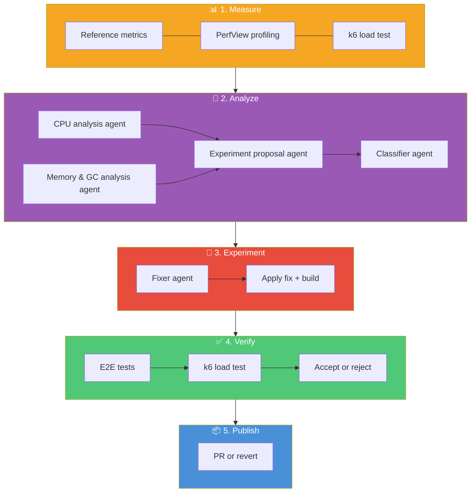

# Architecture

## Overview

Hone is an agentic performance optimization system. A set of PowerShell scripts (the "harness") orchestrate a closed-loop cycle: stress-test the API to find bottlenecks, analyze the measurements with AI to propose a fix, experiment by implementing the fix, verify that it actually works (functionally and performance-wise), then publish the results. The target API is treated as a **blackbox** — Hone only requires buildable source, a functional test suite, and k6 stress tests.

## Design Principles

1. **Harness is separate from the target.** The PowerShell scripts contain no API-specific logic. They invoke external tools (`dotnet`, `k6`, `copilot`, `git`) and parse their output. Any API that provides the required contracts can be optimized.

2. **The target API is a blackbox.** Hone builds its own understanding of the API's internals by analyzing the source code during the optimization process. It requires three contracts: (1) a buildable source project, (2) a functional test suite acting as a regression gate, and (3) stress test scenarios producing measurable metrics to find hot spots.

3. **Measure first, then think.** Every experiment starts with measurement. You can't optimize what you haven't measured. The agent analyzes real stress test data — not guesses.

4. **Relative improvement, not absolute targets.** The loop accepts any measurable performance improvement and rejects regressions beyond a configured tolerance. It stops when the optimization surface is exhausted.

5. **Every experiment is a git branch.** Code changes are isolated on branches. Successful experiments produce PRs; failed experiments are reverted but preserve the experiment and measurement artifacts for the record.

6. **Structured data everywhere.** PowerShell objects, JSON metrics, typed results. No string parsing when avoidable.

## Single Experiment Flow

Each experiment is a self-contained cycle of 5 phases:

### Two Separate Measurement Passes

Phases 2 and 4 each run k6 load tests, but for different purposes:

| | Diagnostic (Phase 2) | Evaluation (Phase 4) |
|---|---|---|
| **Purpose** | Deep profiling for AI analysis | Fair benchmarking for accept/reject |
| **Runs when** | Optimization queue is empty | Every experiment |
| **k6 passes** | 1 | 5 (median selected) |
| **PerfView** | ✅ CPU stacks + alloc types (pass 1), GC stats (pass 2) | ❌ Off |
| **Overhead** | 5–15% (acceptable — numbers discarded) | ~1% (dotnet-counters only) |
| **Output used for** | Analyst agent context | Accept/reject decision |

This separation ensures profiling overhead never biases the metrics used to judge whether an optimization helped.

### Queue-Driven Analysis

The analysis pipeline (Phase 2) only runs when the **optimization queue** is empty. Each analysis pass produces 1-3 ranked optimization opportunities stored in `optimization-queue.json`. Subsequent experiments pick from this queue one at a time. When the queue is exhausted, the analysis pipeline runs again with fresh metrics and profiling data.

## Decision Logic

After measuring, the harness compares three metrics against the previous experiment:

| Metric | Improved when | Regressed when |
|--------|--------------|----------------|
| p95 Latency | Decreased | Increased > MaxRegressionPct (default 10%) AND absolute delta > MinAbsoluteP95DeltaMs (default 5ms) |
| Requests/sec | Increased | Decreased > MaxRegressionPct |
| Error Rate | Decreased | Increased > MaxRegressionPct |

**Accept** if at least one metric improved and none regressed. **Reject** if any metric regressed beyond tolerance. **Stale** if nothing changed.

When performance is flat but OS-level resource usage (CPU or working set) decreased, the **efficiency tiebreaker** accepts the experiment — preventing premature stops when there are genuine resource gains. The tiebreaker can be disabled or tuned via `Tolerances.Efficiency` in `config.psd1`.

## Stacked Diffs (Continuous Mode)

In the default stacked diffs mode, experiments form a **linear branch chain**. Each experiment branches from the previous one, regardless of outcome.

- **Successful experiments** get PRs that diff against the last successful branch — reviewers see only the incremental optimization.
- **Failed experiments** have their code change reverted in-place, but the branch is pushed with artifacts preserved (k6 results, analysis, root cause) for the record.
- PRs are **fire-and-forget** — the loop creates them and continues immediately without waiting for merge.

## Exit Conditions

The loop stops when any of these conditions is met:

| Condition | Meaning |
|-----------|---------|
| **Max consecutive failures** | Too many consecutive regressions + stale experiments (default 10) |
| **Max experiments** | Configured experiment limit reached |
| **Build failure** | Code doesn't compile (non-stacked mode) |
| **Test failure** | E2E regression detected (non-stacked mode) |

In stacked mode, build and test failures trigger a revert-and-continue rather than an abort, allowing the loop to recover and try different optimizations.

## Diagnostic Measurement Details

The diagnostic measurement pipeline (Phase 2, when queue is empty) runs a **multi-pass** profiling cycle. Collectors are organized into **groups** — collectors in the same group run together in one pass, while different groups get separate passes with their own API + k6 cycle.

### Collection Groups

Some collectors interfere with each other (e.g., PerfView's `/GCOnly` flag suppresses CPU sampling). The group system ensures non-interfering collectors run together and interfering ones run in separate passes:

| Group | Collectors | Description |
|-------|-----------|-------------|
| `etw-cpu` | `perfview-cpu` | CPU sampling + allocation ticks via PerfView (`/ThreadTime /DotNetAllocSampled`) |
| `etw-gc` | `perfview-gc` | GC statistics via PerfView `/GCOnly` (minimal overhead) |
| `default` | `dotnet-counters` | Runs in **every** pass (lightweight, non-interfering) |

### Per-Pass Flow

For each collection group:

1. **Reset database** — ensure clean seed data
2. **Start API** — launch the .NET process
3. **Start collectors** — group collectors + default collectors attach to the API process
4. **Run k6** — single load-test pass using the diagnostic scenario
5. **Stop collectors** — detach, merge traces, export raw artifacts
6. **Export data** — convert raw artifacts to analysis-friendly formats
7. **Stop API** — clean shutdown

After all passes complete:

8. **Run analyzers** — each analyzer plugin consumes the merged collector data from all passes
9. **Aggregate reports** — all analyzer reports are injected into the main analyst agent's prompt

Since profiling tools (especially PerfView kernel-level CPU sampling) add 5–15% overhead to latency/throughput, the k6 numbers from diagnostic passes are **discarded** — they are never compared against baselines or used in accept/reject decisions. Only the profiling data (stacks, GC stats) is carried forward.

## Diagnostic Plugin Architecture

The diagnostic framework uses a **plugin model** for both data collection and analysis. New profiling tools can be added by dropping in a directory — no orchestrator changes needed.

### Collector Plugins (`harness/collectors/<name>/`)

Each collector is a self-contained directory with 4 files:

| File | Purpose |
|------|---------|
| `collector.psd1` | Metadata: Name, Group, RequiresAdmin, OverheadImpact, DefaultSettings |
| `Start-Collector.ps1` | Start data collection targeting an API process → returns handle |
| `Stop-Collector.ps1` | Stop collection → returns raw artifact paths |
| `Export-CollectorData.ps1` | Convert raw artifacts to analysis-friendly format |

The `Group` field in `collector.psd1` controls which pass the collector runs in. Collectors with `Group = 'default'` run in every pass. Other collectors in the same group run together; different groups get separate passes.

Built-in collectors: `perfview-cpu` (CPU sampling + allocation ticks), `perfview-gc` (GC statistics), `dotnet-counters` (runtime counters)

### Analyzer Plugins (`harness/analyzers/<name>/`)

Each analyzer is a self-contained directory with 3 files:

| File | Purpose |
|------|---------|
| `analyzer.psd1` | Metadata: name, RequiredCollectors, AgentName, DefaultSettings |
| `Invoke-Analyzer.ps1` | Build prompt from collector data, call AI agent, parse response |
| `agent.md` | Copilot agent definition (also symlinked to `.github/agents/`) |

Built-in analyzers: `cpu-hotspots` (reads folded CPU stacks from `perfview-cpu`), `memory-gc` (reads GC report from `perfview-gc`)

Each analyzer declares its `RequiredCollectors` in `analyzer.psd1`. If a required collector's data is not available (e.g., the collector is disabled or failed), the analyzer is automatically skipped with a warning — it does not block other analyzers from running.

### Adding a New Plugin

**New collector** (e.g., `thread-contention`):
1. Create `harness/collectors/thread-contention/` with the 4 standard files
2. Set `Group` in `collector.psd1` — use an existing group if compatible, or create a new one
3. Add settings under `Diagnostics.CollectorSettings.'thread-contention'` in `config.psd1`

**New analyzer** (e.g., `thread-hotspots`):
1. Create `harness/analyzers/thread-hotspots/` with the 3 standard files
2. Add settings under `Diagnostics.AnalyzerSettings.'thread-hotspots'` in `config.psd1`
3. Copy or symlink `agent.md` to `.github/agents/`

The orchestrators (`Invoke-DiagnosticCollection.ps1`, `Invoke-DiagnosticAnalysis.ps1`, `Invoke-DiagnosticMeasurement.ps1`) automatically discover and run all enabled plugins.
