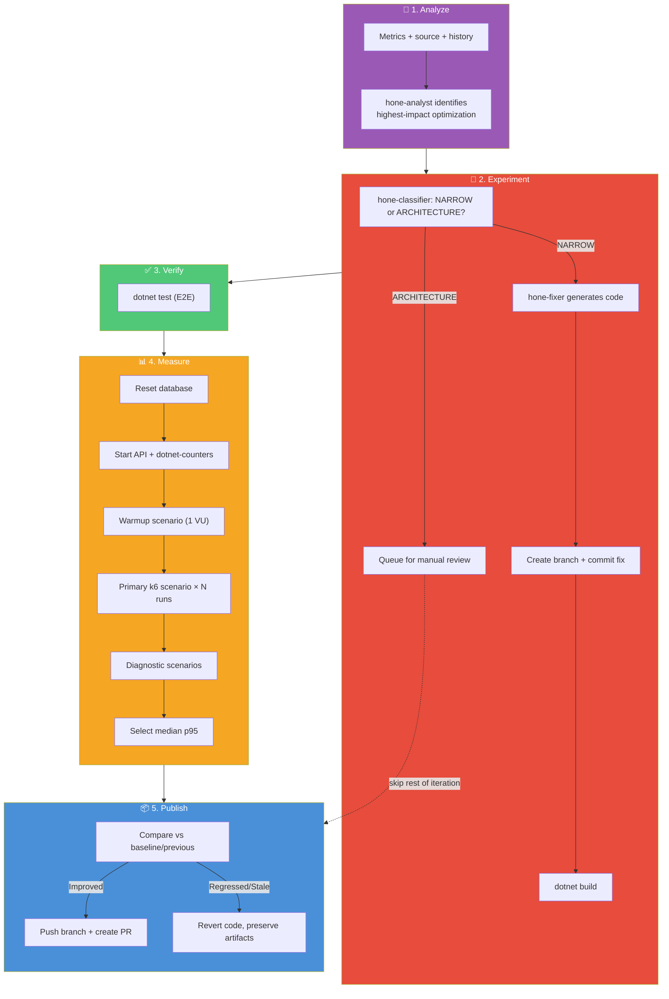
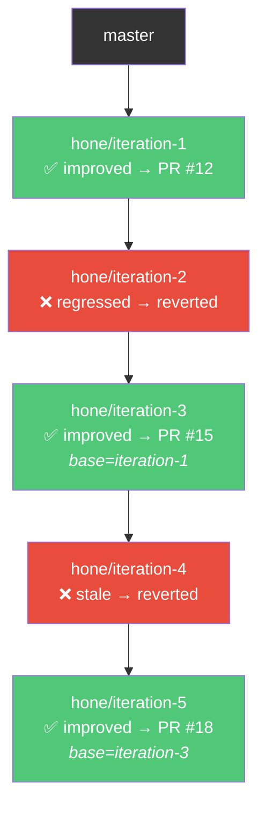

# Architecture

## Overview

Hone is an agentic performance optimization system. A set of PowerShell scripts (the "harness") orchestrate a closed-loop cycle: stress-test the API to find bottlenecks, analyze the measurements with AI to propose a fix, experiment by implementing the fix, verify that it actually works (functionally and performance-wise), then publish the results. The target API is treated as a **blackbox** — Hone only requires buildable source, a functional test suite, and k6 stress tests.

## Design Principles

1. **Harness is separate from the target.** The PowerShell scripts contain no API-specific logic. They invoke external tools (`dotnet`, `k6`, `copilot`, `git`) and parse their output. Any API that provides the required contracts can be optimized.

2. **The target API is a blackbox.** Hone builds its own understanding of the API's internals by analyzing the source code during the optimization process. It requires three contracts: (1) a buildable source project, (2) a functional test suite acting as a regression gate, and (3) stress test scenarios producing measurable metrics to find hot spots.

3. **Measure first, then think.** The baseline is established before any optimization begins, and every iteration's analysis is grounded in real stress test data — not guesses. You can't optimize what you haven't measured.

4. **Relative improvement, not absolute targets.** The loop accepts any measurable performance improvement and rejects regressions beyond a configured tolerance. It stops when the optimization surface is exhausted.

5. **Every iteration is a git branch.** Code changes are isolated on branches. Successful iterations produce PRs; failed iterations are reverted but preserve the experiment and measurement artifacts for the record.

6. **Structured data everywhere.** PowerShell objects, JSON metrics, typed results. No string parsing when avoidable.

## Single Iteration Flow

Each iteration is a self-contained cycle of 7 steps across 5 logical phases. The README's high-level cycle (Measure → Analyze → Experiment → Verify → Publish) is a simplified view — below is the detailed reality.

For iteration 1, baseline metrics are used as the "current" for analysis (there is no prior fix to measure). For iteration 2+, the previous iteration's post-fix metrics are used.

## Three-Agent Pipeline

The AI work is split across three specialized agents, each with a single responsibility. All agents use the standalone `copilot` CLI; the default model is configured in `config.psd1` under `Copilot.Model`, with per-agent overrides via `AnalysisModel`, `ClassificationModel`, and `FixModel`.

| Agent | Script | Default Model | Input | Output |
|-------|--------|---------------|-------|--------|
| **hone-analyst** | `Invoke-AnalysisAgent.ps1` | `claude-opus-4.6` | Performance metrics, source file list, dotnet-counters data, optimization history | JSON: `filePath`, `explanation`, `additionalOpportunities` |
| **hone-classifier** | `Invoke-ClassificationAgent.ps1` | `claude-haiku-4.5` | File path + optimization description | Scope: `NARROW` or `ARCHITECTURE` with reasoning |
| **hone-fixer** | `Invoke-FixAgent.ps1` | `claude-opus-4.6` | File path + optimization description | Complete replacement file content |

**Scope gating:** Only `NARROW` changes (single-file, implementation-only) proceed through the fix → build → verify → measure cycle. `ARCHITECTURE` changes (multi-file, schema, dependency, or contract changes) are added to `optimization-queue.md` but **not applied**. This prevents the autonomous loop from making risky structural changes. Architecture items can be manually tagged `[APPROVED]` in the queue to override the gate.

## Optimization History

Two markdown files form a feedback loop that prevents the analyst from repeating failed approaches. Both are fed into the analysis prompt via `Build-AnalysisContext.ps1`.

| File | Purpose | Format |
|------|---------|--------|
| `optimization-log.md` | Append-only ledger of every tried optimization | Iteration, file, description, outcome (`improved` / `regressed` / `stale` / `queued`) |
| `optimization-queue.md` | Ranked list of untried opportunities with scope tags | Checked off when tried; `[APPROVED]` overrides the architecture gate |

The analyst sees the full history and queue on every iteration, so it can:
- Avoid re-proposing optimizations that already regressed or went stale
- Pick up queued opportunities rather than duplicating analysis work
- Prioritize narrow-scope items that are ready to implement

## Measurement Quality

Measurement reliability is critical — the accept/reject decision depends on it. Several mechanisms reduce noise.

**Multi-run median.** The primary k6 scenario runs N times per iteration (default 5, configurable via `ScaleTest.MeasuredRuns`). The median p95 is selected as the representative result, filtering out outlier runs.

**Variance analysis.** The coefficient of variation (CV) is computed across the N runs. A CV above 10% triggers a warning in the output, signaling unreliable results. The CV, range, and standard deviation are included in PR bodies and comparison output.

**Warmup.** Before measured runs, a lightweight 1-VU warmup scenario (`warmup.js`) exercises the API to warm up JIT compilation, connection pools, and thread pools. This prevents first-run penalties from contaminating measurements.

**Cooldown + GC.** Between consecutive measured runs, a cooldown period (default 3s, `ScaleTest.CooldownSeconds`) allows GC, thread pool, and TCP TIME_WAIT connections to settle. If the API exposes a `/diag/gc` endpoint, the harness triggers a server-side GC collect during cooldown.

**Database reset.** `Reset-Database.ps1` drops and recreates the database between iterations so every iteration starts with identical seed data — eliminating data volume drift as a confounding variable.

## Multi-Scenario Testing

The harness supports multiple k6 scenarios beyond the primary optimization scenario.

A **scenario registry** (`scale-tests/thresholds.json`) lists all available k6 scenarios with metadata. One scenario is marked `use_for_optimization: true` — this is the primary scenario whose metrics drive accept/reject decisions.

After the primary scenario completes successfully, all other registered scenarios run as **diagnostics** via `Invoke-AllScaleTests.ps1 -SkipPrimary`. These capture per-scenario metrics without influencing the accept/reject outcome.

**Baselines** are captured for every scenario (stored as `baseline-{name}.json`). PR bodies include a **per-scenario breakdown table** showing each scenario's p95 delta versus its baseline, giving reviewers visibility into cross-cutting performance impact.

## Run Metadata

`run-metadata.json` (in the results directory) tracks machine info, baseline timing, loop start/completion timestamps, and per-iteration outcomes (timing, metrics, PR links, branch names). This supports post-hoc analysis of optimization runs across different machines or configurations.

## Decision Logic

After measuring, the harness compares three metrics against the previous iteration:

| Metric | Improved when | Regressed when |
|--------|--------------|----------------|
| p95 Latency | Decreased | Increased > MaxRegressionPct (default 10%) AND absolute delta > MinAbsoluteP95DeltaMs (default 5ms) |
| Requests/sec | Increased | Decreased > MaxRegressionPct |
| Error Rate | Decreased | Increased > MaxRegressionPct |

**Accept** if at least one metric improved and none regressed. **Reject** if any metric regressed beyond tolerance. **Stale** if nothing changed.

When performance is flat but OS-level resource usage (CPU or working set) decreased, the **efficiency tiebreaker** accepts the iteration — preventing premature stops when there are genuine resource gains.

## Stacked Diffs (Continuous Mode)

In the default stacked diffs mode, iterations form a **linear branch chain**. Each iteration branches from the previous one, regardless of outcome.

- **Successful iterations** get PRs that diff against the last successful branch — reviewers see only the incremental optimization.
- **Failed iterations** have their code change reverted in-place, but the branch is pushed with artifacts preserved (k6 results, analysis, root cause) for the record.
- PRs are **fire-and-forget** — the loop creates them and continues immediately without waiting for merge.

## Exit Conditions

The loop stops when any of these conditions is met:

| Condition | Meaning |
|-----------|---------|
| **Max consecutive failures** | Too many consecutive regressions + stale iterations (default 10) |
| **Max iterations** | Configured iteration limit reached |
| **Build failure** | Code doesn't compile (non-stacked mode) |
| **Test failure** | E2E regression detected (non-stacked mode) |

In stacked mode, build and test failures trigger a revert-and-continue rather than an abort, allowing the loop to recover and try different optimizations.
