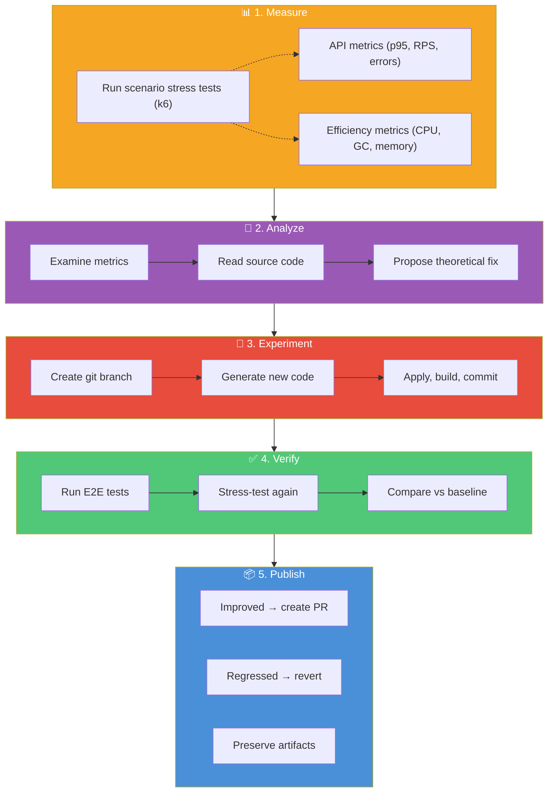
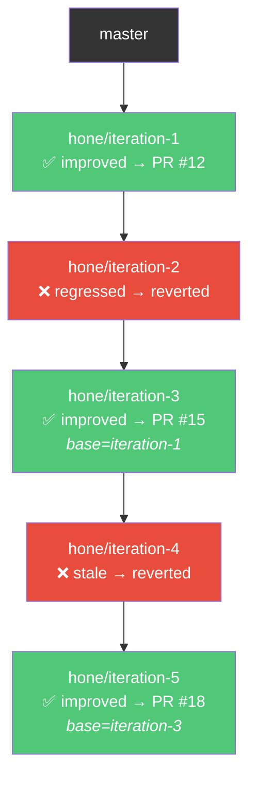

# Architecture

## Overview

Hone is an agentic performance optimization system. A set of PowerShell scripts (the "harness") orchestrate a closed-loop cycle: stress-test the API to find bottlenecks, analyze the measurements with AI to propose a fix, experiment by implementing the fix, verify that it actually works (functionally and performance-wise), then publish the results. The target API is treated as a **blackbox** — Hone only requires buildable source, a functional test suite, and k6 stress tests.

## Design Principles

1. **Harness is separate from the target.** The PowerShell scripts contain no API-specific logic. They invoke external tools (`dotnet`, `k6`, `copilot`, `git`) and parse their output. Any API that provides the required contracts can be optimized.

2. **The target API is a blackbox.** Hone builds its own understanding of the API's internals by analyzing the source code during the optimization process. It requires three contracts: (1) a buildable source project, (2) a functional test suite acting as a regression gate, and (3) stress test scenarios producing measurable metrics to find hot spots.

3. **Measure first, then think.** Every iteration starts with measurement. You can't optimize what you haven't measured. The agent analyzes real stress test data — not guesses.

4. **Relative improvement, not absolute targets.** The loop accepts any measurable performance improvement and rejects regressions beyond a configured tolerance. It stops when the optimization surface is exhausted.

5. **Every iteration is a git branch.** Code changes are isolated on branches. Successful iterations produce PRs; failed iterations are reverted but preserve the experiment and measurement artifacts for the record.

6. **Structured data everywhere.** PowerShell objects, JSON metrics, typed results. No string parsing when avoidable.

## Single Iteration Flow

Each iteration is a self-contained cycle of 5 phases:

## Decision Logic

After measuring, the harness compares three metrics against the previous iteration:

| Metric | Improved when | Regressed when |
|--------|--------------|----------------|
| p95 Latency | Decreased | Increased > MaxRegressionPct (default 10%) AND absolute delta > MinAbsoluteP95DeltaMs (default 5ms) |
| Requests/sec | Increased | Decreased > MaxRegressionPct |
| Error Rate | Decreased | Increased > MaxRegressionPct |

**Accept** if at least one metric improved and none regressed. **Reject** if any metric regressed beyond tolerance. **Stale** if nothing changed.

When performance is flat but OS-level resource usage (CPU or working set) decreased, the **efficiency tiebreaker** accepts the iteration — preventing premature stops when there are genuine resource gains.

## Stacked Diffs (Continuous Mode)

In the default stacked diffs mode, iterations form a **linear branch chain**. Each iteration branches from the previous one, regardless of outcome.

- **Successful iterations** get PRs that diff against the last successful branch — reviewers see only the incremental optimization.
- **Failed iterations** have their code change reverted in-place, but the branch is pushed with artifacts preserved (k6 results, analysis, root cause) for the record.
- PRs are **fire-and-forget** — the loop creates them and continues immediately without waiting for merge.

## Exit Conditions

The loop stops when any of these conditions is met:

| Condition | Meaning |
|-----------|---------|
| **Max consecutive failures** | Too many consecutive regressions + stale iterations (default 10) |
| **Max iterations** | Configured iteration limit reached |
| **Build failure** | Code doesn't compile (non-stacked mode) |
| **Test failure** | E2E regression detected (non-stacked mode) |

In stacked mode, build and test failures trigger a revert-and-continue rather than an abort, allowing the loop to recover and try different optimizations.
