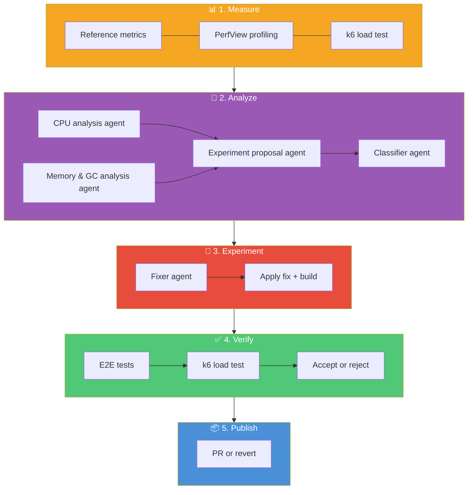

# Architecture

## Overview

Hone is an agentic performance optimization system. A set of PowerShell scripts (the "harness") orchestrate a closed-loop cycle: stress-test the API to find bottlenecks, analyze the measurements with AI to propose a fix, experiment by implementing the fix, verify that it actually works (functionally and performance-wise), then publish the results. The target API is treated as a **blackbox** — Hone only requires buildable source, a functional test suite, and k6 stress tests.

## Design Principles

1. **Harness is separate from the target.** The PowerShell scripts contain no API-specific logic. They invoke external tools (`dotnet`, `k6`, `copilot`, `git`) and parse their output. Any API that provides the required contracts can be optimized.

2. **The target API is a blackbox.** Hone builds its own understanding of the API's internals by analyzing the source code during the optimization process. It requires three contracts: (1) a buildable source project, (2) a functional test suite acting as a regression gate, and (3) stress test scenarios producing measurable metrics to find hot spots.

3. **Measure first, then think.** Every experiment starts with measurement. You can't optimize what you haven't measured. The agent analyzes real stress test data — not guesses.

4. **Relative improvement, not absolute targets.** The loop accepts any measurable performance improvement and rejects regressions beyond a configured tolerance. It stops when the optimization surface is exhausted.

5. **Every experiment is a git branch.** Code changes are isolated on branches. Successful experiments produce PRs; failed experiments are reverted but preserve the experiment and measurement artifacts for the record.

6. **Structured data everywhere.** PowerShell objects, JSON metrics, typed results. No string parsing when avoidable.

7. **Deterministic orchestration, not agent-orchestrated-agents.** Early iterations attempted to have agents orchestrate other agents, but this rarely succeeded beyond 2–3 experiment iterations before deviating enough to cause failures. The harness uses deterministic scripted orchestration (PowerShell + state files) and restricts each agent to a single focused domain. This separation — deterministic process control with probabilistic reasoning only where needed — is a deliberate design choice.

8. **Focused agents over monolithic analysis.** A single "analysis agent" that reasoned over CPU stack traces, ETW events, memory allocations, and source code simultaneously hit context window limits and produced lower-quality results. Splitting into three tiers — CPU Analyst (uplevels raw stack traces), Memory Analyst (uplevels GC/allocation data), and Top-level Analyst (reasons over upleveled summaries + source) — significantly improved analysis quality.

9. **Profiling data drives prioritization.** Without profiling data, the analyst can examine code and find issues, but cannot prioritize by ROI. Adding PerfView CPU sampling and GC profiling to the diagnostic pass enabled the analyst to focus on the highest-impact hotspots first — the difference between fixing a 0.1% contributor vs. a 30% contributor.

### Shared Infrastructure

`HoneHelpers.psm1` is a PowerShell module imported by all harness scripts. It exports common functions:

| Function | Purpose |
|----------|---------|
| `Write-Status` | Timestamped status output |
| `Get-HoneConfig` | Centralized config loading |
| `Wait-ApiHealthy` | HTTP health check with configurable timeout and retry |
| `Limit-String` | Word-boundary string truncation |
| `Invoke-CopilotWithTimeout` | Copilot CLI subprocess with timeout |
| `Add-ExperimentMetadatum` | Experiment entry recording |
| `New-ExperimentPR` | GitHub PR creation |
| `Build-StackNote` | Stacked-diffs PR chain visualization |

Configuration is validated at startup by `Test-HoneConfig.ps1`, which checks paths, ranges, tool availability, and warns about non-obvious setting interactions.

## Single Experiment Flow

Each experiment is a self-contained cycle of 5 phases:



### Two Separate Measurement Passes

Phases 2 and 4 each run k6 load tests, but for different purposes:

| | Diagnostic (Phase 2) | Evaluation (Phase 4) |
|---|---|---|
| **Purpose** | Deep profiling for AI analysis | Fair benchmarking for accept/reject |
| **Runs when** | Optimization queue is empty | Every experiment |
| **k6 passes** | 1 | 5 (median selected) |
| **PerfView** | ✅ CPU stacks + alloc types (pass 1), GC stats (pass 2) | ❌ Off |
| **Overhead** | 5–15% (acceptable — numbers discarded) | ~1% (dotnet-counters only) |
| **Output used for** | Analyst agent context | Accept/reject decision |

This separation ensures profiling overhead never biases the metrics used to judge whether an optimization helped.

### Queue-Driven Analysis

The analysis pipeline (Phase 2) only runs when the **optimization queue** is empty. Each analysis pass produces 1-3 ranked optimization opportunities stored in `optimization-queue.json`. Subsequent experiments pick from this queue one at a time. When the queue is exhausted, the analysis pipeline runs again with fresh metrics and profiling data.

### Agent Invocation

All AI agents in the main pipeline (analyst, classifier, fixer) are invoked via a unified runner (`Invoke-CopilotAgent.ps1`). The runner ensures:

- **Timeout enforcement** — bounded by `Copilot.AgentTimeoutSec` (default 600s). If an agent hangs, the process is killed.
- **Proper argument quoting** — uses `System.Diagnostics.ProcessStartInfo.ArgumentList` for OS-native quoting of prompt content.
- **UTF-8 encoding** — handles non-ASCII characters in source code and agent responses.
- **Retry with JSON sanitization** — strips markdown fences, sanitizes JavaScript literals, retries on parse failure.

For details on the agent pipeline, see [Agent Designs](agent-designs.md).

## Decision Logic

After measuring, the harness compares three metrics against the previous experiment:

| Metric | Improved when | Regressed when |
|--------|--------------|----------------|
| p95 Latency | Decreased | Increased > MaxRegressionPct (default 10%) AND absolute delta > MinAbsoluteP95DeltaMs (default 5ms) |
| Requests/sec | Increased | Decreased > MaxRegressionPct AND absolute delta > MinAbsoluteRPSDelta (default 5 req/s) |
| Error Rate | Decreased | Increased > MaxRegressionPct AND absolute delta > MinAbsoluteErrorRateDelta (default 0.005) |

To prevent false positives on metrics with small baselines, each metric requires both a percentage change exceeding `MaxRegressionPct` AND an absolute change exceeding a per-metric threshold:

| Metric | Absolute Threshold Config | Default |
|--------|--------------------------|---------|
| p95 Latency | `MinAbsoluteP95DeltaMs` | 5ms |
| Requests/sec | `MinAbsoluteRPSDelta` | 5 req/s |
| Error Rate | `MinAbsoluteErrorRateDelta` | 0.005 (0.5%) |

**Accept** if at least one metric improved and none regressed.**Reject** if any metric regressed beyond tolerance. **Stale** if nothing changed.

When performance is flat but OS-level resource usage (CPU or working set) decreased, the **efficiency tiebreaker** accepts the experiment — preventing premature stops when there are genuine resource gains. The tiebreaker can be disabled or tuned via `Tolerances.Efficiency` in `config.psd1`.

## Stacked Diffs (Continuous Mode)

In the default stacked diffs mode, experiments form a **linear branch chain**. Each experiment branches from the previous one, regardless of outcome.


- **Successful experiments** get PRs that diff against the last successful branch — reviewers see only the incremental optimization.
- **Failed experiments** have their code change reverted in-place, but the branch is pushed with artifacts preserved (k6 results, analysis, root cause) for the record.
- PRs are **fire-and-forget** — the loop creates them and continues immediately without waiting for merge.

## Exit Conditions

The loop stops when any of these conditions is met:

| Condition | Meaning |
|-----------|---------|
| **Max consecutive failures** | Too many consecutive regressions + stale experiments (default 10) |
| **Max experiments** | Configured experiment limit reached |
| **Build failure** | Code doesn't compile (non-stacked mode) |
| **Test failure** | E2E regression detected (non-stacked mode) |

In stacked mode, build and test failures trigger a revert-and-continue rather than an abort, allowing the loop to recover and try different optimizations.

## Diagnostic Measurement Details

The diagnostic measurement pipeline (Phase 2, when queue is empty) runs a **multi-pass** profiling cycle. Collectors are organized into **groups** — collectors in the same group run together in one pass, while different groups get separate passes with their own API + k6 cycle.

### Collection Groups

Some collectors interfere with each other (e.g., PerfView's `/GCOnly` flag suppresses CPU sampling). The group system ensures non-interfering collectors run together and interfering ones run in separate passes:

| Group | Collectors | Description |
|-------|-----------|-------------|
| `etw-cpu` | `perfview-cpu` | CPU sampling + allocation ticks via PerfView (`/ThreadTime /DotNetAllocSampled`) |
| `etw-gc` | `perfview-gc` | GC statistics via PerfView `/GCOnly` (minimal overhead) |
| `default` | `dotnet-counters` | Runs in **every** pass (lightweight, non-interfering) |

### Per-Pass Flow

For each collection group:

1. **Reset database** — ensure clean seed data
2. **Start API** — launch the .NET process
3. **Start collectors** — group collectors + default collectors attach to the API process
4. **Run k6** — single load-test pass using the diagnostic scenario
5. **Stop collectors** — detach, merge traces, export raw artifacts
6. **Export data** — convert raw artifacts to analysis-friendly formats
7. **Stop API** — clean shutdown

After all passes complete:

8. **Run analyzers** — each analyzer plugin consumes the merged collector data from all passes
9. **Aggregate reports** — all analyzer reports are injected into the main analyst agent's prompt

Since profiling tools (especially PerfView kernel-level CPU sampling) add 5–15% overhead to latency/throughput, the k6 numbers from diagnostic passes are **discarded** — they are never compared against baselines or used in accept/reject decisions. Only the profiling data (stacks, GC stats) is carried forward.

### Diagnostic Safety

- **k6 timeout** — diagnostic runs are bounded by `Diagnostics.K6TimeoutSec` (default 300s)
- **Process cleanup** — all collector processes have try/finally guards ensuring cleanup on error
- **Log rotation** — `hone.jsonl` rotates at `Logging.MaxFileSizeMB` (default 50MB)
- **Atomic queue writes** — optimization queue JSON uses temp-file-then-rename for crash safety

## Diagnostic Plugin Architecture

The diagnostic framework uses a **plugin model** for both data collection and analysis. New profiling tools can be added by dropping in a directory — no orchestrator changes needed.

> For detailed documentation of each agent's role, inputs, outputs, and model configuration, see [Agent Designs](agent-designs.md). For design ideas on evolving the agent pipeline, see [Future Extensions](future-extensions.md).

### Collector Plugins (`harness/collectors/<name>/`)

Each collector is a self-contained directory with 4 files:

| File | Purpose |
|------|---------|
| `collector.psd1` | Metadata: Name, Group, RequiresAdmin, OverheadImpact, DefaultSettings |
| `Start-Collector.ps1` | Start data collection targeting an API process → returns handle |
| `Stop-Collector.ps1` | Stop collection → returns raw artifact paths |
| `Export-CollectorData.ps1` | Convert raw artifacts to analysis-friendly format |

The `Group` field in `collector.psd1` controls which pass the collector runs in. Collectors with `Group = 'default'` run in every pass. Other collectors in the same group run together; different groups get separate passes.

Built-in collectors: `perfview-cpu` (CPU sampling + allocation ticks), `perfview-gc` (GC statistics), `dotnet-counters` (runtime counters)

### Analyzer Plugins (`harness/analyzers/<name>/`)

Each analyzer is a self-contained directory with 3 files:

| File | Purpose |
|------|---------|
| `analyzer.psd1` | Metadata: name, RequiredCollectors, AgentName, DefaultSettings |
| `Invoke-Analyzer.ps1` | Build prompt from collector data, call AI agent, parse response |
| `agent.md` | Copilot agent definition (also symlinked to `.github/agents/`) |

Built-in analyzers: `cpu-hotspots` (reads folded CPU stacks from `perfview-cpu`), `memory-gc` (reads GC report from `perfview-gc`)

Each analyzer declares its `RequiredCollectors` in `analyzer.psd1`. If a required collector's data is not available (e.g., the collector is disabled or failed), the analyzer is automatically skipped with a warning — it does not block other analyzers from running.

### Adding a New Collector Plugin

Collectors gather raw profiling data during diagnostic measurement passes. To add a new collector:

1. **Create the plugin directory** with 4 standard files:

   ```
   harness/collectors/<name>/
   ├── collector.psd1          # Metadata
   ├── Start-Collector.ps1     # Start data collection
   ├── Stop-Collector.ps1      # Stop collection, return artifact paths
   └── Export-CollectorData.ps1  # Convert raw artifacts to analysis-friendly format
   ```

2. **Define metadata** in `collector.psd1`:

   ```powershell
   @{
       Name            = 'thread-contention'
       Description     = 'Thread contention analysis via ETW events'
       Group           = 'etw-cpu'     # Run with CPU sampling, or create a new group
       RequiresAdmin   = $true
       OverheadImpact  = 'medium'
       DefaultSettings = @{
           Enabled       = $true
           MaxCollectSec = 90
       }
   }
   ```

   The `Group` field controls pass scheduling:
   - Collectors in the **same group** run together in one pass
   - **Different groups** get separate passes (each with its own API instance + k6 run)
   - `Group = 'default'` collectors run in **every** pass (use for lightweight, non-interfering tools)

3. **Add configuration** under `Diagnostics.CollectorSettings` in `harness/config.psd1`:

   ```powershell
   CollectorSettings = @{
       'thread-contention' = @{ Enabled = $true; MaxCollectSec = 90 }
   }
   ```

4. **Follow the existing collector contracts** — use `perfview-cpu` or `dotnet-counters` as templates:
   - `Start-Collector.ps1` receives the API process ID and settings, returns a handle object
   - `Stop-Collector.ps1` receives the handle, stops collection, returns raw artifact paths
   - `Export-CollectorData.ps1` converts raw artifacts into formats suitable for analyzer consumption

The orchestrators (`Invoke-DiagnosticCollection.ps1`, `Invoke-DiagnosticMeasurement.ps1`) automatically discover and run all enabled collectors — no orchestrator changes needed.

### Adding a New Analyzer Plugin

Analyzers consume collector data and produce AI-generated analysis reports. To add a new analyzer:

1. **Create the plugin directory** with 3 standard files:

   ```
   harness/analyzers/<name>/
   ├── analyzer.psd1       # Metadata
   ├── Invoke-Analyzer.ps1 # Build prompt, call agent, parse response
   └── agent.md            # Copilot agent definition
   ```

2. **Define metadata** in `analyzer.psd1`:

   ```powershell
   @{
       Name               = 'thread-hotspots'
       Description        = 'Thread contention hotspot analysis'
       RequiredCollectors = @('thread-contention')
       OptionalCollectors = @()
       AgentName          = 'hone-thread-profiler'
       DefaultSettings    = @{
           Model = 'claude-opus-4.6'
       }
   }
   ```

   The `RequiredCollectors` field declares dependencies. If a required collector's data is unavailable (disabled, failed, or not yet run), the analyzer is **automatically skipped** with a warning — it does not block other analyzers.

3. **Write the agent definition** in `agent.md` following the standard format:

   ```markdown
   ---
   name: hone-thread-profiler
   description: >
     Thread contention analysis agent...
   tools: []
   ---

   # System prompt with role, output schema, and analysis rules
   ```

   Analyzer agents typically have `tools: []` (no tools) — they receive all data in the prompt rather than reading files.

4. **Symlink the agent definition** into `.github/agents/`:

   ```powershell
   New-Item -ItemType SymbolicLink `
       -Path '.github/agents/hone-thread-profiler.agent.md' `
       -Target '../../harness/analyzers/thread-hotspots/agent.md'
   ```

5. **Add configuration** under `Diagnostics.AnalyzerSettings` in `harness/config.psd1`:

   ```powershell
   AnalyzerSettings = @{
       'thread-hotspots' = @{ Enabled = $true; Model = 'claude-opus-4.6' }
   }
   ```

The orchestrator (`Invoke-DiagnosticAnalysis.ps1`) automatically discovers and runs all enabled analyzers. Reports are injected into the hone-analyst prompt under the "Diagnostic Profiling Reports" section.

### Adding a New Main Pipeline Agent

Adding an agent to the main experiment pipeline (as opposed to an analyzer agent) requires integration with the loop orchestrator. Follow this pattern:

1. **Create the agent definition** in `.github/agents/<name>.agent.md` with YAML frontmatter (`name`, `description`, `tools`) and the system prompt.

2. **Write an invoker script** in `harness/` following conventions:
   - Use `[CmdletBinding()]` and `param()` blocks
   - Resolve the model from config: per-agent override → `Copilot.Model` → hardcoded fallback
   - Set `[Console]::OutputEncoding = [System.Text.Encoding]::UTF8` before calling `copilot`
   - Parse structured JSON output with error handling
   - Save prompt and response artifacts to `experiment-N/`
   - Return a `[PSCustomObject]` with a `Success` property

3. **Integrate into `Invoke-HoneLoop.ps1`** at the appropriate phase. The current pipeline is: analyst → classifier → fixer. New agents can be inserted between existing stages or added as new phases.

4. **Add model configuration** in `harness/config.psd1` under the `Copilot` section.

### Supporting a Different Target API

Hone treats the target API as a blackbox (see [Design Principles](#design-principles)). It requires three contracts:

1. **Buildable source** — a project that compiles with `dotnet build`
2. **Functional test suite** — E2E tests runnable with `dotnet test` that act as a regression gate
3. **k6 stress test scenarios** — load test scripts that produce measurable performance metrics

To point Hone at a different API, update these settings in `harness/config.psd1`:

| Setting | Purpose | Example |
|---------|---------|---------|
| `Api.SolutionPath` | Solution file path | `my-api/MyApi.sln` |
| `Api.ProjectPath` | API project directory | `my-api/MyApi/` |
| `Api.TestProjectPath` | Test project directory | `my-api/MyApi.Tests/` |
| `Api.BaseUrl` | API base URL when running | `http://localhost:5000` |
| `Api.HealthEndpoint` | Health check path for readiness | `/health` |
| `Api.ResultsPath` | Where to store measurement results | `my-api/results/` |
| `ScaleTest.ScenarioPath` | Primary k6 scenario | `my-api/scale-tests/scenarios/baseline.js` |

The harness scripts, agent definitions, and decision logic remain unchanged.

### Adding New k6 Scenarios

1. **Create the scenario** in `scale-tests/scenarios/`:

   ```javascript
   import http from 'k6/http';
   import { check } from 'k6';

   export const options = {
       stages: [/* ramp-up, sustain, ramp-down */],
   };

   export default function () {
       const base = __ENV.BASE_URL;
       // Request logic with check() for validation
   }
   ```

2. **Register the scenario** in `ScaleTest.Scenarios` in `harness/config.psd1` with its k6 scenario path.

3. **Set thresholds** in `scale-tests/thresholds.json` for the new scenario.

4. **Establish a baseline** by running `Get-PerformanceBaseline.ps1`, which will capture baseline metrics for all registered scenarios.

### Custom Exit Conditions and Decision Logic

The accept/reject decision for each experiment is implemented in `harness/Compare-Results.ps1`. It compares three metrics (p95 latency, requests/sec, error rate) against the previous baseline using configurable tolerances from `harness/config.psd1`.

To modify the decision logic:

- **Adjust thresholds**: Change `Tolerances.MaxRegressionPct` (default 10%) and per-metric absolute thresholds (`MinAbsoluteP95DeltaMs`, `MinAbsoluteRPSDelta`, `MinAbsoluteErrorRateDelta`) in config
- **Add new metrics**: Extend `Compare-Results.ps1` to compare additional metrics (e.g., p99 latency, custom k6 counters)
- **Modify the efficiency tiebreaker**: Tune `Tolerances.Efficiency` settings to control when flat-performance experiments are accepted based on reduced resource usage (CPU, working set)
- **Change exit conditions**: Adjust `Loop.MaxConsecutiveFailures` and `Loop.MaxExperiments` in config
