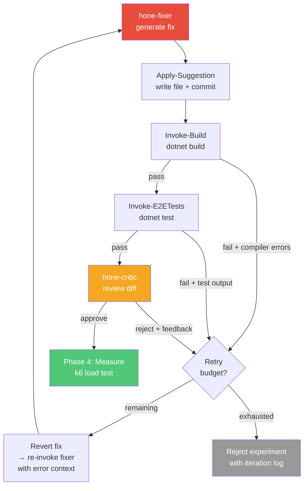

# Feature: Evaluator-Optimizer Loop

> **Status:** Design · **Scope:** Harness agent pipeline (Phases 3–4)
> **Motivation:** [Anthropic Evaluator-Optimizer pattern](https://www.anthropic.com/research/building-effective-agents), [future-extensions.md](../../future-extensions.md#iterative-fixer)

---

## Problem Statement

Hone's fixer agent is **single-shot**: it generates code in one pass, and if the subsequent build or E2E tests fail, the experiment is immediately rejected. This discards optimizations that would succeed with minor corrections — a compilation error from a missing `using` statement, a test failure from an off-by-one in a LINQ projection, or a critic-catchable semantic issue like a cache without invalidation.

Both Anthropic and OpenAI identify the **evaluator-optimizer loop** as a foundational pattern for production agent systems: a generator produces output, an evaluator critiques it, and the generator refines until the output passes quality gates or a budget is exhausted.

This feature introduces that pattern to Hone through two complementary components:

1. **Iterative Fixer** — retry loop with build/test error feedback
2. **Critic Agent** — AI review gate between the fixer and measurement

Together, these form the **evaluator-optimizer loop** that replaces the current single-shot fixer.

---

## Current Flow (Before)

```
Fixer → Apply → Build → fail? → REJECT experiment
                  ↓ pass
                Test → fail? → REJECT experiment
                  ↓ pass
                Measure → Compare → Accept/Reject
```

The fixer gets exactly one attempt. Build failures, test failures, and semantic issues all result in immediate experiment rejection.

### Current Code Path

1. **`Invoke-HoneLoop.ps1` Phase 3** (≈line 623): Calls `Invoke-FixAgent.ps1`
2. **`Invoke-FixAgent.ps1`**: Builds prompt (`FilePath` + `Explanation` + optional `RootCauseDocument`), calls `Invoke-CopilotAgent.ps1` with agent `hone-fixer`, extracts code block from response
3. **`Apply-Suggestion.ps1`**: Validates path, writes file, creates git branch + commit
4. **`Invoke-Build.ps1`**: Runs `dotnet build`, returns `Success`/`ExitCode`/`Output`
5. On build failure → `Invoke-FailureHandler.ps1` → revert + rejected PR
6. **`Invoke-E2ETests.ps1`**: Runs `dotnet test`, returns `Success`/`ExitCode`/`Output`/`FailedTests`
7. On test failure → `Invoke-FailureHandler.ps1` → revert + rejected PR

**Key data available at failure points:**
- Build failure: full compiler output (errors, warnings, file:line references)
- Test failure: full test output (failed test names, stack traces, assertion messages), TRX file
- Both: the current file content (post-fix), the original optimization goal, the RCA document

---

## Proposed Flow (After)



The fixer gets up to N attempts (configurable). Each failed attempt feeds concrete error output back into the next fixer invocation. After build + test pass, the critic agent reviews the diff for semantic issues and scope adherence before committing to the expensive load-test cycle.

---

## Component 1: Iterative Fixer

### Design

A new script **`Invoke-IterativeFix.ps1`** wraps the existing fixer → apply → build → test sequence in a retry loop. It replaces the inline Phase 3 logic in `Invoke-HoneLoop.ps1`.

```powershell
# Invoke-IterativeFix.ps1 — Pseudocode
param(
    [string]$FilePath,          # Target file (relative to target dir)
    [string]$Explanation,       # Optimization description from analyst
    [string]$RootCauseDocument, # RCA markdown (optional)
    [int]$MaxAttempts = 3,      # Retry budget (config: Fixer.MaxAttempts)
    [string]$ConfigPath,
    [string]$TargetDir,
    [string]$TargetName,
    [int]$Experiment
)

$iterationLog = @()

for ($attempt = 1; $attempt -le $MaxAttempts; $attempt++) {

    # Build the fixer prompt (with error context on retry)
    $fixerPrompt = Build-FixerPrompt `
        -FilePath $FilePath `
        -Explanation $Explanation `
        -RootCauseDocument $RootCauseDocument `
        -PreviousErrors $previousErrors `
        -Attempt $attempt

    # 1. Invoke fixer agent
    $fixResult = Invoke-FixAgent -Prompt $fixerPrompt ...
    if (-not $fixResult.Success) {
        $iterationLog += @{ Attempt = $attempt; Stage = 'fix_generation'; Error = 'Agent failed' }
        continue
    }

    # 2. Apply the fix
    $applyResult = Apply-Suggestion -NewContent $fixResult.CodeBlock ...
    if (-not $applyResult.Success) {
        $iterationLog += @{ Attempt = $attempt; Stage = 'apply'; Error = $applyResult.Description }
        continue
    }

    # 3. Build
    $buildResult = Invoke-Build ...
    if (-not $buildResult.Success) {
        $previousErrors = Format-BuildErrors -Output $buildResult.Output
        $iterationLog += @{ Attempt = $attempt; Stage = 'build'; Error = $previousErrors }
        Revert-FixForRetry -BranchName $applyResult.BranchName ...
        continue
    }

    # 4. E2E Tests
    $testResult = Invoke-E2ETests ...
    if (-not $testResult.Success) {
        $previousErrors = Format-TestErrors -Output $testResult.Output -FailedTests $testResult.FailedTests
        $iterationLog += @{ Attempt = $attempt; Stage = 'test'; Error = $previousErrors }
        Revert-FixForRetry -BranchName $applyResult.BranchName ...
        continue
    }

    # 5. All gates passed
    return [PSCustomObject]@{
        Success       = $true
        Attempt       = $attempt
        IterationLog  = $iterationLog
        FixResult     = $fixResult
        ApplyResult   = $applyResult
        BuildResult   = $buildResult
        TestResult    = $testResult
    }
}

# Budget exhausted
return [PSCustomObject]@{
    Success      = $false
    Attempt      = $MaxAttempts
    IterationLog = $iterationLog
    ExitReason   = 'retry_budget_exhausted'
}
```

### Retry Prompt Construction

On retry, the fixer receives augmented context:

```
## Previous Attempt Failed

Attempt {N-1} of this optimization failed at the {build|test} stage.

### Error Output
{full compiler errors OR test failure output with stack traces}

### Current File Content (after failed fix)
{the file as it exists post-fix, before revert}

### Original Optimization Goal
{original explanation + RCA}

Fix the errors above while still achieving the optimization goal.
Return the COMPLETE corrected file in a fenced code block.
```

This gives the fixer:
1. The specific errors to fix (not generic "try again")
2. The current state of the file (so it can make targeted corrections)
3. The original goal (so it doesn't lose sight of the optimization)

### Revert-for-Retry Flow

Between retry attempts, the fix must be reverted so the next attempt starts from a clean state:

```powershell
function Revert-FixForRetry {
    # git checkout -- <file>   (restore original file content)
    # git reset HEAD~1         (undo the fix commit, keep branch)
    # This preserves the experiment branch but removes the failed fix
}
```

This is distinct from `Revert-ExperimentCode.ps1` (which creates a revert *commit* for the rejected PR). The retry revert is a soft reset — it undoes the commit but stays on the experiment branch so the next attempt can create a new commit.

### Guards

**Test file modification guard.** After each fix, before proceeding to build:
```powershell
$testPaths = $config.Api.TestProjectPaths  # e.g., ['SampleApi.Tests/']
$changedFiles = git diff --name-only HEAD~1
$touchesTests = $changedFiles | Where-Object {
    foreach ($tp in $testPaths) { if ($_ -like "$tp*") { return $true } }
}
if ($touchesTests) {
    # Reject this iteration — fixer tried to modify tests
    $iterationLog += @{ Attempt = $attempt; Stage = 'guard'; Error = 'Fix modified test files' }
    Revert-FixForRetry ...
    continue
}
```

**Diff size monitoring.** Track lines changed per attempt:
```powershell
$diffStat = git diff --stat HEAD~1
$linesChanged = # parse insertions + deletions
if ($attempt -gt 1 -and $linesChanged -gt $firstAttemptLines * $config.Fixer.MaxDiffGrowthFactor) {
    # Scope creep — fix is growing too large across retries
    $iterationLog += @{ Attempt = $attempt; Stage = 'guard'; Error = "Diff grew to $linesChanged lines (limit: ...)" }
    Revert-FixForRetry ...
    continue
}
```

---

## Component 2: Critic Agent

### Design

A new agent **`hone-critic`** reviews the fixer's diff after build + tests pass, before the experiment proceeds to the expensive load-test measurement phase.

The critic is an **evaluator**, not a generator — it approves or rejects with structured feedback. On rejection, its feedback is fed back to the fixer as error context for the next retry attempt.

### Agent Definition: `hone-critic.agent.md`

```markdown
---
name: hone-critic
description: >
  Code review agent for the Hone optimization harness. Reviews optimization
  diffs for correctness, scope adherence, and potential issues before
  load testing. Returns structured approve/reject JSON.
tools:
  - read
---

# Hone Critic — Optimization Review Gate

You review code changes produced by the hone-fixer agent. Your role is to
catch issues that compile and pass tests but are semantically incorrect,
introduce potential regressions under load, or violate scope boundaries.

## Review Criteria

### 1. Correctness
- Does the change correctly implement the described optimization?
- Are there edge cases that unit tests might not cover but load tests will expose?
- Does the change handle concurrency correctly? (thread safety, cache invalidation, connection pooling)

### 2. Scope Adherence
- Does the change stay within the declared file?
- Does it introduce new dependencies, architectural patterns, or API contract changes?
- Is the change proportional to the described optimization, or has it grown in scope?

### 3. Performance Risk
- Could this change cause regressions under high concurrency?
- Does caching have proper invalidation?
- Are there N+1 query risks introduced by the change?
- Are database connections properly scoped and disposed?

### 4. Code Quality
- Is the change idiomatic for the target language/framework?
- Are there obvious bugs (null references, resource leaks, type mismatches)?

## Output Format

Return ONLY valid JSON:

{
  "verdict": "approve" | "reject",
  "confidence": "high" | "medium" | "low",
  "issues": [
    {
      "severity": "blocking" | "warning",
      "category": "correctness" | "scope" | "performance" | "quality",
      "description": "What the issue is and why it matters",
      "suggestion": "How to fix it"
    }
  ],
  "summary": "One-sentence overall assessment"
}

## Rules

1. Read the target file to see the full context of the change
2. Only reject for BLOCKING issues — warnings are informational
3. Be specific in suggestions — the fixer agent will use them to correct the code
4. When in doubt about performance impact, approve — the load test will catch real regressions
5. Do NOT reject for style or formatting — only for correctness, scope, and performance
6. Entire response must be valid JSON — nothing else
```

### Invoker: `Invoke-CriticAgent.ps1`

```powershell
param(
    [Parameter(Mandatory)][string]$FilePath,
    [Parameter(Mandatory)][string]$Explanation,
    [Parameter(Mandatory)][string]$Diff,             # git diff output
    [string]$ClassificationScope = 'narrow',          # from classifier
    [string]$ConfigPath,
    [string]$TargetDir,
    [string]$TargetName,
    [int]$Experiment
)

$prompt = @"
Review this optimization diff and determine if it should proceed to load testing.

## Target Project: $TargetName

## Target File
$FilePath

## Optimization Goal
$Explanation

## Scope Classification
This change was classified as: $ClassificationScope

## Diff
``````diff
$Diff
``````

Read the full file at the path above for context, then evaluate the diff
against the review criteria. Respond with JSON only.
"@

$agentResult = & Invoke-CopilotAgent `
    -AgentName 'hone-critic' `
    -Prompt $prompt `
    -ModelConfigKey 'CriticModel' `
    -DefaultModel 'gpt-5.4' `
    -MaxRetries 1 `
    -RetryPromptSuffix 'Respond with strict RFC 8259 JSON only.' `
    -ConfigPath $ConfigPath `
    -WorkingDirectory $TargetDir

# Parse verdict
$parsed = $agentResult.ParsedJson
$verdict = if ($parsed.verdict) { $parsed.verdict.ToLower() } else { 'reject' }

# Extract blocking issues for fixer feedback
$blockingIssues = @($parsed.issues | Where-Object { $_.severity -eq 'blocking' })
$feedback = ($blockingIssues | ForEach-Object {
    "[$($_.category)] $($_.description)`nSuggestion: $($_.suggestion)"
}) -join "`n`n"

return [PSCustomObject]@{
    Success    = ($agentResult.ExitCode -eq 0)
    Approved   = ($verdict -eq 'approve')
    Verdict    = $verdict
    Confidence = $parsed.confidence
    Issues     = $parsed.issues
    Feedback   = $feedback    # Formatted for fixer retry prompt
    Summary    = $parsed.summary
    Response   = $agentResult.ResponseText
}
```

### Integration with Iterative Fixer

The critic slots into the retry loop after build + test pass:

```powershell
# In Invoke-IterativeFix.ps1, after tests pass:

if ($config.Critic.Enabled) {
    $diff = git diff HEAD~1 -- $FilePath
    $criticResult = & Invoke-CriticAgent `
        -FilePath $FilePath `
        -Explanation $Explanation `
        -Diff $diff `
        -ClassificationScope $classificationScope ...

    if (-not $criticResult.Approved) {
        $previousErrors = "## Critic Review Feedback`n`n$($criticResult.Feedback)"
        $iterationLog += @{
            Attempt = $attempt; Stage = 'critic'
            Error = $criticResult.Summary
            Issues = $criticResult.Issues
        }
        Revert-FixForRetry ...
        continue    # ← Fixer retries with critic feedback
    }
}

# Critic approved (or disabled) — proceed to measurement
```

---

## Configuration

New config keys in `config.psd1`:

```powershell
# Under existing Copilot section:
Copilot = @{
    # ... existing keys ...
    FixModel    = 'claude-opus-4.6'       # Highest reasoning for code generation (not 1M context variant)
    CriticModel = 'gpt-5.4'              # Cross-vendor critic with extra-high reasoning
}

# New top-level section:
Fixer = @{
    # Iterative fixer settings
    MaxAttempts       = 3       # Total attempts (1 = single-shot, current behavior)
    MaxDiffGrowthFactor = 3.0  # Max diff size multiplier vs. first attempt

    # Test file protection
    TestFileGuard     = $true  # Reject fixes that modify test files
}

Critic = @{
    Enabled           = $true  # Enable critic review gate
}
```

**Backward compatibility:** Setting `Fixer.MaxAttempts = 1` and `Critic.Enabled = $false` produces the exact current single-shot behavior.

**Model rationale:**

| Role | Model | Reasoning Level | Why |
|------|-------|----------------|-----|
| Fixer | `claude-opus-4.6` | Highest | Code generation demands top-tier reasoning to produce correct, scoped, performant edits. Upgraded from `claude-sonnet-4.6` to maximise first-attempt success rate. |
| Critic | `gpt-5.4` | Extra-high | Cross-vendor diversity eliminates same-model blind spots. GPT-5.4's extra-high reasoning catches semantic and architectural issues that the generator's own lineage may overlook. |

---

## Required Changes — File-by-File

### New Files

| File | Purpose |
|------|---------|
| `harness/Invoke-IterativeFix.ps1` | Retry loop orchestrator — wraps fixer → apply → build → test → critic |
| `harness/Invoke-CriticAgent.ps1` | Critic agent invoker — builds prompt, parses verdict |
| `.github/agents/hone-critic.agent.md` | Critic agent definition — review criteria and output schema |

### Modified Files

| File | Change |
|------|--------|
| `harness/Invoke-HoneLoop.ps1` | **Phase 3**: Replace inline fixer + build logic with single call to `Invoke-IterativeFix.ps1`. Handle `IterationLog` in experiment metadata and PR body. |
| `harness/Invoke-FixAgent.ps1` | Add `-PreviousErrors` and `-Attempt` parameters for retry context. Augment prompt construction with error feedback section when retrying. |
| `harness/Apply-Suggestion.ps1` | No functional change, but add support for re-applying to the same branch (soft reset between retries instead of branch creation). |
| `harness/Revert-ExperimentCode.ps1` | Add `-SoftReset` switch for retry reverts (git reset, not revert commit). |
| `harness/Build-PRBody.ps1` | Include iteration log in PR body — show how many attempts were needed, what errors were encountered. |
| `harness/config.psd1` | Add `Fixer` and `Critic` configuration sections. |
| `harness/Test-HoneConfig.ps1` | Validate new config keys (ranges, types, interaction warnings). |
| `harness/Invoke-FailureHandler.ps1` | Handle `retry_budget_exhausted` outcome — include full iteration log in rejected PR. |
| `harness/Export-ExperimentRCA.ps1` | Include iteration log as a section in the RCA document. |
| `harness/Stage-ExperimentArtifacts.ps1` | Stage per-iteration artifacts (fixer prompts, critic responses). |
| `docs/agent-designs.md` | Add hone-critic agent documentation section. |
| `docs/architecture.md` | Update Phase 3 flow diagram and description. |

### Unchanged Files

These files require **no changes** — the iterative loop is fully encapsulated above them:

- `Invoke-AnalysisAgent.ps1` — upstream of the fixer
- `Invoke-ClassificationAgent.ps1` — upstream of the fixer
- `Invoke-Build.ps1` — called by `Invoke-IterativeFix.ps1`, interface unchanged
- `Invoke-E2ETests.ps1` — called by `Invoke-IterativeFix.ps1`, interface unchanged
- `Invoke-CopilotAgent.ps1` — agent runner, interface unchanged
- `Compare-Results.ps1` — downstream of the fixer
- `Invoke-ScaleTests.ps1` — downstream of the fixer

---

## Iteration Log Schema

Each experiment's iteration log is saved as `experiment-N/iteration-log.json`:

```json
{
  "experiment": 5,
  "totalAttempts": 3,
  "finalOutcome": "success",
  "attempts": [
    {
      "attempt": 1,
      "stage": "build",
      "outcome": "failed",
      "durationSec": 45,
      "error": "CS1061: 'AppDbContext' does not contain a definition for 'Products'...",
      "diffLines": 24,
      "artifacts": {
        "fixResponse": "experiment-5/iterations/attempt-1/fix-response.md",
        "buildLog": "experiment-5/iterations/attempt-1/build.log"
      }
    },
    {
      "attempt": 2,
      "stage": "critic",
      "outcome": "rejected",
      "durationSec": 62,
      "error": "Cache lacks invalidation on write path",
      "criticVerdict": "reject",
      "criticConfidence": "high",
      "diffLines": 28,
      "artifacts": {
        "fixResponse": "experiment-5/iterations/attempt-2/fix-response.md",
        "criticResponse": "experiment-5/iterations/attempt-2/critic-response.json"
      }
    },
    {
      "attempt": 3,
      "stage": "critic",
      "outcome": "approved",
      "durationSec": 58,
      "diffLines": 32,
      "artifacts": {
        "fixResponse": "experiment-5/iterations/attempt-3/fix-response.md",
        "criticResponse": "experiment-5/iterations/attempt-3/critic-response.json"
      }
    }
  ]
}
```

---

## Implementation Phases

### Phase A: Iterative Fixer (no critic)

Implement the retry loop with build/test error feedback only. The critic is disabled.

1. Create `Invoke-IterativeFix.ps1` with retry loop, error formatting, guards
2. Modify `Invoke-FixAgent.ps1` to accept retry context parameters
3. Modify `Revert-ExperimentCode.ps1` to support soft reset mode
4. Add `Fixer` config section + validation in `Test-HoneConfig.ps1`
5. Update `Invoke-HoneLoop.ps1` Phase 3 to call `Invoke-IterativeFix.ps1`
6. Update `Build-PRBody.ps1` and `Export-ExperimentRCA.ps1` for iteration log
7. Update `Stage-ExperimentArtifacts.ps1` for per-iteration artifacts

**Validation:** Run against sample-api. Compare accept/reject rates vs. single-shot baseline. Count experiments recovered by retries.

### Phase B: Critic Agent

Layer the critic on top of the iterative fixer.

1. Create `hone-critic.agent.md` agent definition
2. Create `Invoke-CriticAgent.ps1` invoker
3. Integrate critic into `Invoke-IterativeFix.ps1` (after test pass, before return)
4. Add `Critic` config section + `CriticModel` to Copilot config
5. Update docs (`agent-designs.md`, `architecture.md`)

**Validation:** Run against sample-api with critic enabled. Track critic approve/reject rates, false positive rate (critic rejects something that would have improved metrics), and impact on overall experiment success rate.

---

## Risk Assessment

| Risk | Mitigation |
|------|------------|
| Retry loop increases experiment wall-clock time | Budget cap (default 3 attempts). Each failed attempt adds ~2-5 min (build + test). Worst case: 3× current Phase 3 time. |
| Fixer generates increasingly aggressive fixes on retry | Diff size guard caps growth. Test file guard prevents test weakening. |
| Critic false positives reject valid optimizations | Conservative criteria: only reject for blocking issues. `Critic.Enabled = $false` disables entirely. Load test remains the ultimate judge. |
| Critic adds cost per experiment | Uses `gpt-5.4` with extra-high reasoning for thorough evaluation. Only runs after build + test pass (~50% of experiments reach this point). Cross-vendor diversity reduces blind spots. |
| Retry revert corrupts git state | Soft reset (`git reset HEAD~1`) is safe — stays on experiment branch. Full test: revert → verify clean state → re-apply. |
| Backward compatibility break | `MaxAttempts = 1` + `Critic.Enabled = $false` = exact current behavior. Default config preserves this for existing users. |
