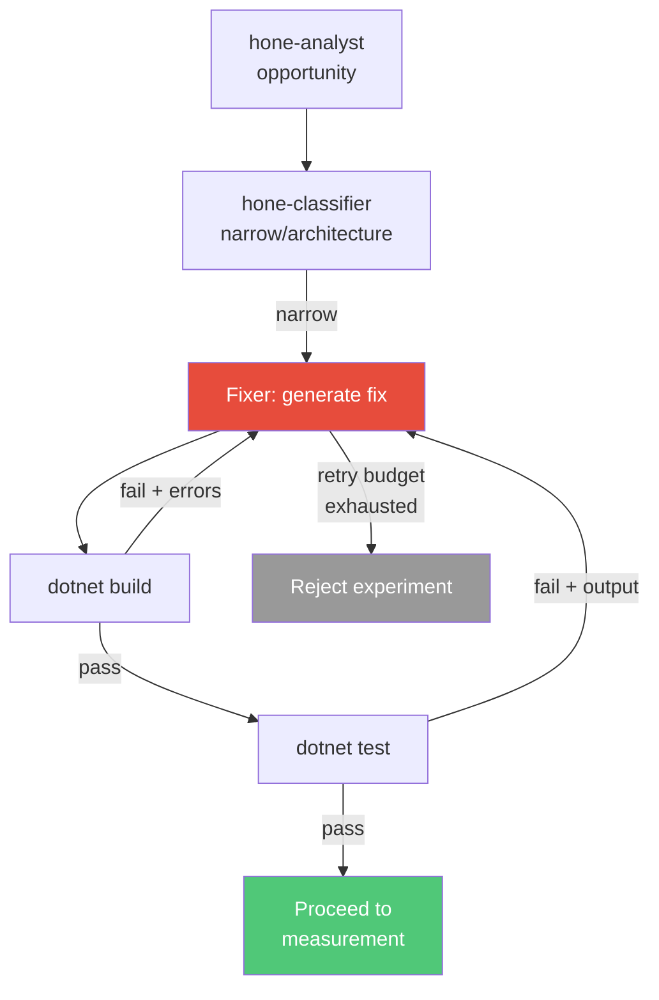
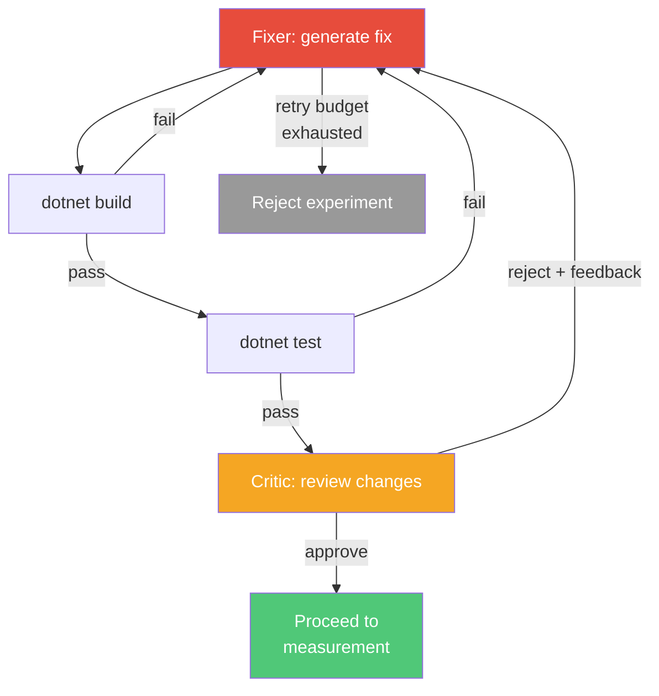
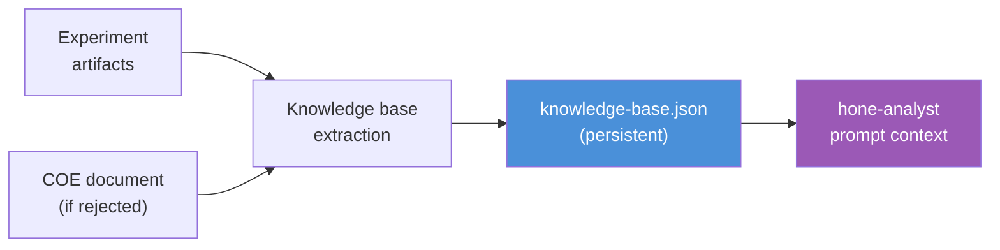

# Future Extensions

This document describes design ideas for evolving Hone's agent pipeline and learning capabilities. For current architecture and extension patterns (adding collectors, analyzers, agents, and targets), see [architecture.md](architecture.md). For current agent details, see [agent-designs.md](agent-designs.md).

---

## Design Ideas

### Iterative Fixer

The current fixer is a **single-shot** agent: it generates a code fix in one pass, and if the subsequent build or E2E tests fail, the experiment is rejected immediately. This limits the fixer's effectiveness — many optimizations require iterative refinement to get right.

An iterative fixer would replace this single-shot pattern with a **retry loop**. On build or test failure, the fixer receives the failure output (compiler errors, test failures with stack traces) and generates a corrected version. This continues until the fix passes both gates or a retry budget is exhausted.

```
Fixer generates fix
    → dotnet build
    → if build fails → feed compiler errors back to fixer → retry
    → dotnet test
    → if tests fail → feed test output + stack traces back to fixer → retry
    → if both pass → proceed to measurement
```

This gives the agent a chance to learn from concrete errors and self-correct — a common pattern in human development where the first attempt at an optimization introduces a subtle bug that's easily fixed once the test failure is visible.



#### Design Considerations

- **Retry budget.** A cap on fixer iterations per experiment (e.g., 3 attempts) prevents runaway loops. Each retry consumes time and API calls, so the budget should balance persistence with efficiency.
- **Feedback quality.** The fixer prompt on retry should include: (1) the original optimization goal, (2) the current file content (post-fix), and (3) the full build/test error output. This gives the agent enough context to make a targeted correction rather than starting from scratch.
- **No test modification.** The fixer must never modify files under `SampleApi.Tests/`. It must fix the production code to satisfy tests, not modify the tests to satisfy the code. This prevents a common failure mode where an agent "cheats" by weakening assertions. The harness should enforce this by rejecting any diff that touches test files.
- **Scope creep risk.** With each retry, the fixer may attempt increasingly aggressive approaches. The harness should monitor diff size across iterations and reject if the change grows beyond a reasonable threshold for a narrow-scope fix.
- **Fallback.** If the fixer exhausts its retry budget, the experiment is rejected with a detailed record of what was attempted and why each iteration failed — feeding the optimization history.

### Actor-Critic Review Gate

Building on the iterative fixer, an **actor-critic model** adds an AI review gate between the fixer and measurement. The fixer (actor) produces code; a separate critic agent reviews the diff before the experiment proceeds to load testing.

The critic enforces invariants that are difficult to check deterministically:

1. **Change quality feedback.** The critic provides substantive review of the actor's changes: correctness, idiomatic style, potential side effects, and alignment with the analyst's root-cause diagnosis. This feedback is returned to the actor on rejection, enabling targeted refinement rather than blind retrying.

2. **Scope guard.** For narrow-classified experiments, the critic ensures the actor's changes stay narrow. If the diff touches multiple files, introduces new classes, modifies dependency injection configuration, adds middleware, or makes other architectural changes, the critic rejects the iteration and instructs the actor to constrain scope. This prevents scope creep from narrow into architecture territory — a risk that increases with each retry as the actor tries more aggressive approaches.

3. **Semantic correctness.** The critic can catch issues that compile and pass tests but are semantically wrong — e.g., a caching optimization that doesn't invalidate on writes (will pass E2E tests with small data but regress under load).



#### Design Considerations

- **Critic model selection.** The critic is a review gate, not a generative agent — a fast model like `claude-haiku-4.5` may suffice since it's evaluating diffs against clear criteria rather than generating code.
- **History integration.** Critic rejections (especially scope violations) should feed the optimization history so the analyst avoids proposing changes that are likely to escalate from narrow to architecture scope during fixing.
- **Dependency on iterative fixer.** The critic is most valuable when the fixer can iterate. Without retry capability, a critic rejection immediately rejects the experiment — adding cost without benefit. Implement the iterative fixer first, then layer the critic on top.
- **Fallback.** If the actor exhausts its retry budget, the experiment is rejected with a detailed COE capturing what was attempted and why each iteration failed — feeding the knowledge base.

### Correction of Error for Rejected Experiments

When an experiment is rejected (regression, test failure, or stale), the current system generates an RCA document via `Export-ExperimentRCA.ps1` that captures *what* happened — the metrics, the diff, and the outcome. However, it doesn't analyze *why* the optimization failed or what lessons should be drawn.

A dedicated **COE (Correction of Error) agent** would go deeper, producing a structured analysis of each rejected experiment.

#### Inputs

The COE agent would receive the full experiment artifacts:

- The analyst's original opportunity proposal (root-cause analysis, expected impact)
- The fixer's generated code diff
- Build output (if the build failed)
- E2E test output (if tests failed, including failing test names and stack traces)
- k6 measurement results (if the experiment regressed)
- Comparison deltas from `Compare-Results.ps1`
- The existing RCA document

#### Output

A structured COE document covering:

| Section | Content |
|---------|---------|
| **What was attempted** | Summary of the optimization and its expected impact |
| **What went wrong** | Root cause of the failure — was it a build error, test regression, performance regression, or stale result? |
| **Why the hypothesis was wrong** | Analysis of whether the analyst's diagnosis was incorrect, the fix was insufficient, or there were interaction effects with prior optimizations |
| **Contributing factors** | Scope misjudgment, missing profiling context, incorrect impact estimate, concurrency effects, etc. |
| **Lessons for future experiments** | Actionable takeaways: "avoid caching on endpoints with high write concurrency", "EF query changes require Include() verification", etc. |

#### Integration

- **Artifact storage.** COE documents are saved as `experiment-N/coe.md` alongside the existing RCA. The RCA captures facts; the COE captures analysis and lessons.
- **History augmentation.** COE lessons are fed into the optimization history context so the analyst avoids repeating the same *class* of mistake, not just the same specific approach. For example, if three different caching attempts all regressed under concurrency, the COE pattern would warn against further caching without addressing the underlying write contention.
- **Non-blocking execution.** The COE agent runs after rejection and does not block the loop from proceeding to the next experiment. It can run asynchronously or as a post-experiment step.

#### Design Considerations

- **Model selection.** The COE agent is analytical, not generative — a mid-tier model (`claude-sonnet-4.5` or `claude-haiku-4.5`) should suffice since it's synthesizing from structured artifacts rather than reasoning from scratch.
- **COE quality improves over time.** As the knowledge base (see below) grows, the COE agent can reference patterns from prior COEs, making its analysis more contextual and less generic.
- **Composability with iterative fixer and actor-critic.** If the iterative fixer and actor-critic review gate are implemented, the COE would also capture per-iteration failure output and the critic's feedback, providing richer failure analysis than a single-shot rejection.

### Persistent Optimization Knowledge Base

The analyst agent currently receives optimization history via `Build-AnalysisContext.ps1`'s `HistoryContext` section — a flat log of what was tried and whether it was accepted or rejected. This tells the agent *what* happened but not *why* things worked or failed, or what patterns have emerged across experiments.

A **persistent knowledge base** would accumulate structured insights across experiments, giving the analyst pattern-level understanding rather than just experiment-level facts.

#### Knowledge Base Content

Each experiment — accepted or rejected — contributes a structured entry:

| Field | Description | Example |
|-------|-------------|---------|
| **Category** | Optimization category | `query-optimization`, `caching`, `serialization`, `memory-pooling` |
| **Technique** | Specific technique applied | `Replace N+1 with eager loading via Include()` |
| **Target** | File and endpoint affected | `CartController.cs` → `GET /api/cart` |
| **Outcome** | Accept/reject with metrics | Accepted: p95 −18%, RPS +12% |
| **Failure mode** | Why it failed (for rejections) | `Test regression: CartEndpointTests.AddItem_ReturnsUpdatedCart` |
| **COE lessons** | Lessons from COE analysis | `Eager loading with Include() on this model requires explicit projection to avoid loading unnecessary navigation properties` |
| **Emerging patterns** | Cross-experiment observations | `EF query optimizations on this codebase consistently yield 15-25% p95 improvement` |

#### Accumulation

A **knowledge base agent** (or a deterministic post-experiment step) distills each experiment's artifacts into a knowledge entry. Entries are appended to a persistent store (`sample-api/results/knowledge-base.json` or a structured Markdown file). Over many runs, this builds a corpus of what works, what doesn't, and why — specific to the target codebase.



#### Analyst Integration

The knowledge base is injected into the analyst's prompt as a new context section alongside the existing `HistoryContext`. Where the history log provides experiment-level facts:

> "experiment-3 tried adding a response cache to ProductsController — rejected (stale)"

...the knowledge base provides pattern-level insights:

> "Caching attempts on read-heavy endpoints have a 75% success rate on this codebase, but caching on endpoints with mixed read/write traffic has regressed 3 out of 3 times due to cache invalidation overhead under concurrency."

This enables the analyst to make more informed decisions about which optimization categories are likely to succeed, which have diminishing returns, and which should be avoided for this target.

#### Design Considerations

- **Prompt budget.** The knowledge base will grow over time. A summarization or pruning strategy is needed to stay within prompt token limits — e.g., keep the 20 most recent entries plus a compressed summary of older patterns.
- **Target-specific vs. general knowledge.** Knowledge entries are tied to the specific target API. However, some insights may be generalizable (e.g., "N+1 queries in EF Core are almost always worth fixing"). A future refinement could separate target-specific knowledge from transferable optimization knowledge.
- **Retrieval strategy.** For small knowledge bases, full-text injection into the prompt works. At scale, a vector search or relevance-ranking step could select the most pertinent entries based on the current experiment's targets and categories.
- **Composability.** The knowledge base composes naturally with the COE extension — rejected experiments produce COEs, which feed high-quality lessons into the knowledge base. Accepted experiments contribute positive evidence via their metrics. Together, they build a richer model than either would alone.
